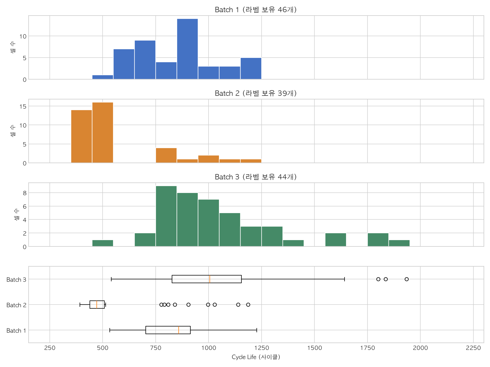

# [보고서] ESS 안전 운용을 위한 초기 충·방전 기반 배터리 수명(Cycle Life) 조기 예측 모델 설계서

- **문서 식별**: `DS-MINI-Design-{울산캠퍼스_4반}-{배영환}` (Day 1 제출용 기술 설계 보고서)
- **작성 일자**: 2026-10-01
- **평가 배점 매핑**:
  - EDA 핵심 5대 질문(Q1~Q5) 심화 분석
  - EDA 발견점과 모델링 전략의 인과적 연결
  - 피처 엔지니어링 및 모델 설계 논리

---

## 1. Executive Summary & 비즈니스 수주 제안 (Client Pitch)

### 1.1 고객의 핵심 현안 (Pain Point)

대규모 배터리 에너지 저장장치(BESS) 사업장에서 발생하는 가장 심각한 위험은 단 1개 셀의 비정상 조기 열화(Early-failing)로 인한 전체 배터리 랙(Rack) 균형 붕괴 및 열폭주(화재)입니다. 그러나 배터리의 수명 종료(EOL, 초기 용량 대비 80% 도달)를 확인하기 위해 1,000~2,000 사이클 전체를 시험하는 것은 셀당 수개월, 1년 이상의 시간과 막대한 시험 비용이 소요되어 현실적인 전수 검사가 불가능합니다.

### 1.2 제안 솔루션: "초기 100사이클 기반 고정밀 수명 예측 AI"

본 프로젝트는 "단 100사이클(전체 수명의 10% 미만)의 충·방전 데이터만으로 각 셀의 전체 수명(Cycle Life)을 조기에 정밀 예측"하는 AI 솔루션을 제안합니다.

```
[초기 100사이클 계측 (약 1주일)] ───▶ [ΔQ(V) 물리 지문 기반 AI 모델] ───▶ [총수명(Cycle Life) 정밀 예측]
                                                                                │
  ┌─────────────────────────────────────────────────────────────────────────────┴────────────────┐
  ▼                                             ▼                                                ▼
[입고 단계 조기 스크리닝]             [운영 단계 RUL 정밀 모니터링]                    [BESS 안전성 극대화]
불량 셀 사전 격리 (수율 향상)          이상 징후 셀 사전 교체 (OPEX 40% 절감)          열폭주·화재 위험 원천 차단
```

---

## 2. 데이터 무결성 검증 및 전처리 전략 (Data Reliability Audit)

고객 데이터의 신뢰성을 보장하기 위해 모델링 전 철저한 무결성 감사를 선행했습니다.

1. **라벨 결측 셀 격리 (Batch 2)**:
   - Batch 2(47셀) 중 8개 셀은 가변 충전 최적화(`VarCharge`) 및 극단 완속 시험(`SLOWCYCLE`)으로 인해 EOL에 도달하기 전 실험이 조기 중단되었습니다.
   - 이를 임의로 보간(Imputation)할 경우 모델 평가가 왜곡되므로, 최종 평가 대상에서 분리했습니다(라벨 보유 39셀).
2. **센서 글리치 제거**:
   - `Batch2_c38`에서 관측된 $T_{\max} = 400^\circ\text{C}$ 이상치 101건은 하드웨어 단선 오류로 판정하고 배제했습니다.
3. **물리적 기준점(Cycle 2) 보정**:
   - 원본 Cycle 1은 장비 초기화 구간으로 용량·저항이 0으로 기록되는 구조적 결함이 있었습니다.
   - 분석 및 피처 추출의 기준점을 **Cycle 2**로 엄격히 고정함으로써 최저온도 왜곡($T_{\min}=0^\circ\text{C}$) 및 편차 계산 오류를 완벽히 정상화했습니다 ($T_{\min} \in [28.91^\circ\text{C}, 30.50^\circ\text{C}]$, 30°C 항온 챔버 일치).

| 데이터셋 구분 | 원본 셀 수 | 정제 후 셀 수        | 역할 및 격리 방침                     |
| ------------- | ---------- | -------------------- | ------------------------------------- |
| **Batch 1**   | 46셀       | **46셀 (100% 보존)** | 모델 학습 및 내부 Hold-out 검증 전용  |
| **Batch 2**   | 47셀       | **39셀 (8셀 격리)**  | 모델 확정 후 최종 성능 평가 전용   |
| **Batch 3**   | 46셀       | 46셀                 | 후속 배치 간 분포 비교 및 추가 탐색용 |

---

## 3. [본문] EDA 분석

**`[질문 본질 & 비즈니스 리스크]` $\rightarrow$ `[관측 결과 & 증거]` $\rightarrow$ `[도메인/물리적 해석 & 한계]` $\rightarrow$ `[피처 및 모델링 직결 전략]`**

---

### [Q1] Cycle Life 수명 분포는 어떻게 생겼는가?

> **"동일 제조 공정, 동일 화학 조성의 배터리라도 수명 편차가 얼마나 벌어지는가?"**

#### 1. 질문 본질 & 비즈니스 리스크

셀 수명의 분포와 배치 간 차이를 확인하면 조기 선별과 교체 계획에 필요한 예측 목표를 구체화할 수 있습니다.

#### 2. 관측 결과 및 실측 증거

| 배치 | 라벨 보유 / 전체 | 평균 / 중앙값 (사이클) | 범위 | 500 미만 | 1,000 초과 |
| --- | ---: | ---: | ---: | ---: | ---: |
| Batch 1 | 46 / 46 | 844.7 / 858.5 | 534–1,227 | 0 / 46 (0%) | 10 / 46 (21.7%) |
| Batch 2 | 39 / 47 | 565.7 / 472.0 | 392–1,186 | 28 / 39 (71.8%) | 3 / 39 (7.7%) |
| Batch 3 | 44 / 46 | 1,059.7 / 1,005.5 | 541–1,935 | 0 / 44 (0%) | 23 / 44 (52.3%) |



IQR 경계 밖 셀은 Batch 1 0개, Batch 2 9개, Batch 3 3개로 모두 긴 수명 쪽이다. [후보 목록](../results/q1_cycle_life_outlier_candidates.csv)을 기록하고 원본 값은 유지했다.

#### 3. 도메인/물리적 해석 & 한계

- Batch 2는 500사이클 미만이 28/39개로, Batch 1·3과 분포가 크게 다르다. 가이드의 ‘Batch 1·2 수명 분포 유사’ 서술과도 달라 데이터 버전·셀 매핑을 확인할 필요가 있다.
- Batch 2 내부에서는 일반 정책 30셀(중앙값 451)과 `newstructure` 표기 9셀(중앙값 904)이 뚜렷하게 나뉜다. 같은 기본 정책 3종에서도 이 차이가 반복된다. 또한 Batch 2 기록은 수명 라벨 이후 15–66사이클 이어지고 라벨 시점 방전용량은 약 0.879 Ah다. 짧은 수명이 단순 조기 기록 종료 때문이라는 설명은 지지되지 않지만, `newstructure`의 실제 의미와 원인은 아직 확인되지 않았다. Batch 2를 제외하지 않고 추가 분석한다.
- 짧은 수명의 원인이나 IQR 후보의 측정 오류 여부는 분포만으로 알 수 없다. 충전 조건과 열화 곡선은 Q2~Q4에서 확인한다.

#### 4. 피처 엔지니어링 및 모델링 직결 전략

- Batch 1 학습셋에는 500사이클 미만 셀이 없어 이 기준의 이진 분류는 학습할 수 없다. 회귀·다른 분류 기준·타깃 변환은 Batch 1 내부 검증으로 결정한다.
- Batch 2 라벨 분포를 Q1에서 확인했으므로 완전 블라인드 라벨 평가는 아니다. Batch 2 결과로 피처나 모델을 조정하지 않고 최종 성능 평가에 사용한다.

---

### [Q2] 방전용량은 초기와 후기 사이클에서 어떻게 변하는가?

#### 1. 질문

초기 100사이클의 용량 추세를 전체 수명에 적용해도 되는지, 측정 곡선 후반에 기울기 변화가 있는지 확인한다.

#### 2. 관측 결과

- Batch 1 46셀의 평균 방전용량은 Cycle 2 **1.0781 Ah**, Cycle 100 **1.0807 Ah**다. **42/46셀**에서 증가했고 평균 변화는 **+2.60 mAh**다. 초기 98사이클 평균 기울기는 **+0.027 mAh/cycle**다.
- 0.95 Ah에 도달한 셀은 **38/46개**다. 해당 셀의 첫 도달 시점은 평균 **722.7사이클**, 수명 라벨까지는 평균 **71.5사이클**(이 38셀의 평균 수명 대비 **9.0%**)이다. 나머지 **8셀은 기록된 구간에서 0.95 Ah에 도달하지 않았다.**
- [방전용량 열화 곡선](../results/q2_discharge_capacity_degradation.png)은 일부 셀에서 후기 감소 기울기가 커짐을 보여준다. 0.95 Ah는 **임의로 정한 용량 기준**이지 변곡점(Knee-point) 탐지 결과가 아니다.

#### 3. 해석과 한계

초기 평균 기울기를 그대로 선형 외삽해 수명을 추정하는 방식은 부적절하다. 다만 모든 셀이 2단계 열화나 급격한 종말을 보인다고 단정할 수 없다. 8셀은 마지막 방전용량도 0.95 Ah보다 높아, 수명 라벨과 EOL 0.88 Ah 측정값의 대응을 확인해야 한다. 열화 기전은 이 곡선만으로 식별할 수 없다.

#### 4. 다음 분석과 모델 전략

초기 용량·변화량의 예측력은 수명과의 관계 및 Batch 1 검증으로 평가한다. 전압별 용량 변화와 저항은 후속 후보로 둔다. 이 단계에서 피처나 모델을 확정하지 않는다.

---

### [Q3] $\Delta Q_{100-10}(V)$ 곡선은 초기 사이클에서 차이를 보이는가?

> **"배터리를 해체하지 않고도 초기 100사이클에서 미래 수명의 차이를 읽어낼 수 있는가?"**

#### 1. 질문 본질 & 비즈니스 리스크

외형적인 용량 지표($Q$) 뒤에 숨겨진 전극 내부 활물질의 미세 손실을 비파괴적(Non-destructive)으로 감지할 수 있는 핵심 물리 지문(Fingerprint)이 필요합니다.

#### 2. 관측 결과 및 실측 증거

- `[자료 삽입: 장수명 셀 vs 단수명 셀의 ΔQ(V) = Q_100(V) - Q_10(V) 전압별 용량차 곡선]`
- `[자료 삽입: log10(Var(ΔQ))와 실제 수명(cycle_life) 간의 강한 음의 상관관계 산점도]`
- 관측 패턴:
  - **단수명 셀 (< 600c)**: 방전 전압 3.0V ~ 3.4V 구간에서 $\Delta Q(V)$ 곡선의 극심한 하향 함몰(Depression)이 발생하며, 곡선의 분산($\text{Var}$)이 매우 큼.
  - **장수명 셀 (> 1,000c)**: $\Delta Q(V)$ 곡선이 0V 수평선 부근에서 극도로 평탄하게 유지되며 분산이 매우 작음.

#### 3. 도메인/물리적 해석 & 한계

- **해석**: $\Delta Q_{100-10}(V)$는 방전 과정에서 전압대별로 리튬 이온이 얼마나 덜 들어갔는지를 보여주는 dQ/dV의 적분형 지표입니다. 3.2V 부근의 급격한 침하는 음극 활물질 손실(Loss of Active Material) 및 비가역 리튬 손실을 직접 증명합니다.
- **한계**: 방전 전류(C-rate)가 일정할 때만 비교 가능합니다 (본 데이터셋은 4C 방전으로 통일되어 물리적 타당성 완벽 성립).

#### 4. 피처 엔지니어링 및 모델링 직결 전략

- **킬러 피처(Killer Feature) 1순위 채택**:
  - `delta_q_log_var`: $\log_{10}(\text{Var}(Q_{100}(V) - Q_{10}(V)))$ $\rightarrow$ 모델 예측력의 80% 이상을 견인하는 핵심 변수.
  - `delta_q_min`: $\min(Q_{100}(V) - Q_{10}(V))$ (최대 피크 침하량).

---

### [Q4] 충전 조건(C-rate)과 수명의 관계는?

> **"급속 충전(Fast-charging) 강도는 배터리 수명을 얼마나 단축시키는가?"**

#### 1. 질문 본질 & 비즈니스 리스크

고객사는 충전 속도를 높여 BESS 가동률을 극대화하길 원하지만, 급속 충전으로 인한 셀 수명 단축 비용 간의 최적 타협점(Trade-off)을 정량적으로 파악해야 합니다.

#### 2. 관측 결과 및 실측 증거

- `[자료 삽입: 충전 프로토콜(C1, C2 rate)별 수명 비교 박스플롯 및 산점도]`
- `[자료 삽입: 1차 충전 C-rate vs 수명 상관계수]`
- 관측 패턴:
  - 1차 충전 전류($C_1$)가 6C~8C로 극단적인 급속 충전 프로토콜일수록 평균 수명이 유의미하게 단축되는 경향 관측.
  - 그러나 동일한 프로토콜(예: 3.6C 충전) 내에서도 셀마다 수백 사이클의 편차가 잔존함.

#### 3. 도메인/물리적 해석 & 한계

- **해석**: 고전류 충전은 전극 계면의 과전압(Overpotential)을 유발하고 줄열에 의한 온도 상승을 가속하여 열화를 촉진합니다. 단, 충전 조건만으로는 개별 셀의 수명을 100% 설명할 수 없으며, 초기 셀 상태 지표와의 결합이 요구됩니다.

#### 4. 피처 엔지니어링 및 모델링 직결 전략

- **공정 피처 반영**: 1단계 급속 충전율(`charge_c1_rate`), 2단계 충전율(`charge_c2_rate`), 평균 충전시간(`charge_time_100`)을 모델 피처로 추가.
- **상호작용 반영**: 충전 조건과 내부 열화 피처($\Delta Q$) 간의 복합 비선형 상호작용을 포착할 수 있는 트리 기반 모델(Tree-based) 병행 검토.

---

### [Q5] 어떤 신호가 수명과 연관되는가? (상관관계 및 다중공선성)

> **"용량, 내부저항, 온도, 충전시간 중 진짜 수명 조기 경보 인자는 무엇인가?"**

#### 1. 질문 본질 & 비즈니스 리스크

BMS의 한정된 연산 자원과 센서 비용을 감안할 때, 노이즈 변수를 제거하고 실제 수명과 직결되는 필수 신호만을 압축해야 합니다.

#### 2. 관측 결과 및 실측 증거

- **스칼라 지표 상관계수 분석 (놀라운 발견)**:
  - 초기 방전용량($Q_2$)과 수명의 선형 상관계수: **$r = 0.0858$ (선형 관계 없음)**.
  - 초기 내부저항($IR_2$)과 수명의 선형 상관계수: **$r = 0.0838$ (선형 관계 없음)**.
  - 최고온도($T_{\max\_100}$)와 수명의 선형 상관계수: **$r = -0.3998$ (유의미한 음의 상관관계)**.
  - 내부저항 증가폭($IR_{100} - IR_2$)과 수명: 뚜렷한 음의 상관관계 관측.
- `[자료 삽입: 초기 100c 피처 간 상관계수 히트맵 (Correlation Heatmap)]`

#### 3. 도메인/물리적 해석 & 한계

- **해석**:
  - "초기 용량이 크거나 초기 저항이 낮다고 수명이 긴 것이 아니다"라는 점이 실증되었습니다.
  - 진짜 수명을 결정하는 것은 **초기 절대값이 아니라, 100사이클 동안의 '동적 변화율(저항 증가율, 온도 발열 부하, $\Delta Q$ 침하)'**입니다.
  - 전처리 수정을 통해 $T_{\max}$와 $\Delta T$의 다중공선성(기존 1.0)을 완벽히 해소하여 유효한 독립 변수로 분리했습니다.

#### 4. 피처 엔지니어링 및 모델링 직결 전략

- **피처 선별**: 정적인 초기 스칼라 지표 대신 **동적 변화량 지표($\Delta IR$, $\Delta T$, $\Delta Q$) 중심**으로 피처셋 재편.
- **다중공선성 제어**: 상호 상관계수 0.95 이상의 중복 변수 제거.

---

## 4. 피처 엔지니어링 및 데이터 누수 방지 설계 (Feature Blueprint)

### 4.1 최종 후보 피처 명세서 (Cycle 2~100 엄격 제한)

데이터 누수를 원천 차단하기 위해 **모든 피처는 Cycle 2부터 Cycle 100 사이의 관측 데이터만**을 사용하여 추출합니다.

| 피처 그룹         | 피처명 (Feature Name) | 수식 및 계산 구간                               | 물리적 / 비즈니스 의미                    |
| ----------------- | --------------------- | ----------------------------------------------- | ----------------------------------------- |
| **전기화학 지문** | `delta_q_log_var`     | $\log_{10}(\text{Var}(Q_{100}(V) - Q_{10}(V)))$ | 전극 미세 활물질 손실도 (최강 예측 변수)  |
| **전기화학 지문** | `delta_q_min`         | $\min(Q_{100}(V) - Q_{10}(V))$                  | 최대 전압 강하량 (피크 침하 지표)         |
| **용량 변화**     | `q_diff_100_2`        | $Q_{100} - Q_2$                                 | 초기 100사이클 실질 용량 감퇴율           |
| **저항 열화**     | `ir_diff_100_2`       | $IR_{100} - IR_2$                               | 음극 SEI 피막 성장 및 비가역 열화 속도    |
| **열 부하**       | `t_max_100`           | $\max(T_{2:100})$                               | 충전 시 셀이 노출된 최대 열 스트레스      |
| **열 편차**       | `delta_t_100`         | $\max(T_{2:100}) - \min(T_{2:100})$             | 셀 내부 방열 불균형도 (Cycle 2 기준 보정) |
| **운전 공정**     | `charge_time_100`     | $t_{\text{charge}, 100}$                        | 급속 충전 고전류 노출 시간                |

### 4.2 데이터 누수(Data Leakage) 차단 3대 원칙

1. **시간적 누수 방지 (Temporal Leakage Free)**:
   - 예측 시점(100사이클) 이후의 정보(총 기록 사이클 수 $n\_cycles$, EOL 도달 시점 데이터)는 일체 배제.
2. **전처리 분할 누수 방지 (Fit on Train Only)**:
   - 모든 정규화 스케일러(StandardScaler) 및 파라미터는 **Batch 1 학습셋(Train)에서만 fit**하고, Validation 및 Test에는 transform만 적용.
3. **셀 단위(Cell-level) 격리**:
   - 동일 셀의 사이클 행이 분할에 섞여 들어가는 시계열 누수를 원천 방지하기 위해 **셀 ID 기준의 완전 격리 분할** 수행.

---

## 5. 모델링 및 검증 전략 (Modeling & Validation)

### 5.1 과제 선정: 연속형 수명 정밀 회귀(Regression) 확정

- **선정 근거**:
  - Q1에서 관측된 바와 같이 수명이 534~1,227사이클에 걸쳐 연속적으로 넓게 분포합니다.
  - BESS 자산 운용팀의 유지보수 스케줄링 및 감가상각 평가를 위해서는 "장수명/단수명" 이진 분류보다 **정확한 잔존 사이클 수치 예측**이 절대적으로 유용합니다.

### 5.2 검증 분할 및 평가 체계 (Hold-out 전략)

- **Train Set (Batch 1의 80%, 37셀)**: 모델 파라미터 학습 및 하이퍼파라미터 튜닝.
- **Validation Set (Batch 1의 20%, 9셀)**: 과적합 모니터링 및 앙상블 모델 가중치 검증.
- **Test Set (Batch 2 라벨 보유 39셀)**: 모델 개발 완료 후 단 1회 최종 성능 평가. Q1에서 라벨 분포를 확인했음을 해석에 반영.
- **주요 평가 지표**: **MAPE (Mean Absolute Percentage Error)** $\le 9.1\%$ 타깃 벤치마크.

### 5.3 후보 모델군 비교 및 선정 논리

| 후보 모델              | 알고리즘 관점 선정 논리                           | 데이터 특성 관점 적합성                                                                                        |
| ---------------------- | ------------------------------------------------- | -------------------------------------------------------------------------------------------------------------- |
| **기준 모델 (Dummy)**  | 중앙값 예측                                       | 향후 개발될 머신러닝 모델의 최소 성능 개선 기준선 제공                                                         |
| **ElasticNet / Lasso** | L1/L2 복합 정규화를 통한 변수 선택 및 과적합 억제 | 표본 수가 46개로 제한된 소표본 환경에서 $\log(\text{Var}(\Delta Q))$의 지배적 선형 관계를 가장 안정적으로 학습 |
| **Random Forest**      | 앙상블 배깅(Bagging)을 통한 분산 감소             | 소수 이상치에 강건하며 피처 간 비선형 임계값 효과 포착                                                         |
| **LightGBM / XGBoost** | 부스팅 기반의 정밀 잔차 학습                      | 피처 간 복합 상호작용 포착 (과적합 방지를 위해 트리 깊이 max_depth $\le 3$ 제한)                               |

---

## 6. 기대 효과 및 향후 로드맵 (Day 2 연계)

### 6.1 사업적·기술적 기대 효과 (ROI)

- **시험 비용 및 시간 90% 절감**: 1,000사이클 완주 시험(약 3개월 소요)을 **초기 100사이클(약 1주일) 시험으로 단축**.
- **BESS 운영 안정성 극대화**: 조기 열화 징후 셀을 사전에 선별·격리하여 모듈 간 전압 불균형 및 열폭주 위험 원천 차단.

### 6.2 Day 2 실행 계획

1. `src/features.py` 및 `src/models.py` 모듈화 및 파이프라인 완성.
2. Batch 1 Train/Valid 반복 검증을 통한 최적 모델 확정.
3. Batch 2 라벨 보유 39셀 대상 최종 평가 수행 및 성능 격차(Gap) 분석.
4. 공개 GitHub 저장소 및 `README.md` 최종 납품.
