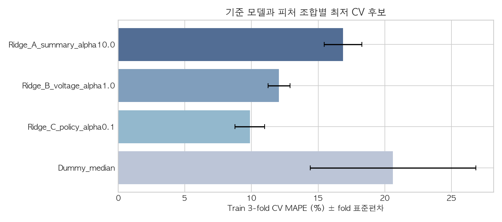
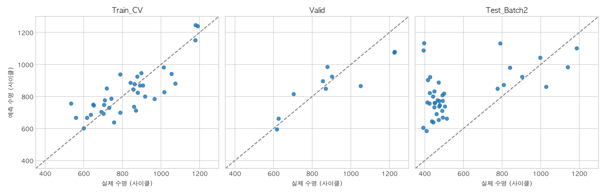

# 2일차 모델 개발·평가 — 1차 검토 결과

2026-10-02. 배터리의 초기 100사이클 정보로 총수명 `cycle_life`를 예측하는 회귀를 구현했다. 전날의 데이터 탐색과 오늘 추가한 Q3·Q4에서 입력 후보를 정하고, 실제 학습·평가를 통해 그 정보가 예측에 도움이 되는지 확인했다. 이 문서는 데이터 선정부터 후보 비교, 평가 결과의 의미와 다음 검토까지 이어지는 1차 실행 기록이다.

## 1. 무엇을 예측하며 어떤 데이터를 사용했는가

목적은 Cycle 100까지 관측한 배터리 정보를 이용해 그 셀이 총 몇 사이클까지 사용할 수 있는지 예측하는 것이다. 이번에 직접 예측한 값은 잔존 수명이 아니라 데이터셋의 총수명 라벨이다. 초기 정보만으로 예측한다는 조건을 지키기 위해 전체 실험 종료 후에 알 수 있는 기록량 `n_cycles`와 수명 정답값은 입력에서 제외했다.

모델 학습·평가에는 Batch 1·2의 **85셀**을 사용했다. 이는 두 배치의 원본 93셀에서 수명 정답값이 없는 8셀을 분리한 결과다.

| 배치    | 원본 셀 수 | 수명값 없는 셀 | 사용한 셀 | 역할                       |
| ------- | ---------: | -------------: | --------: | -------------------------- |
| Batch 1 |         46 |              0 |        46 | Train 36셀·Validation 10셀 |
| Batch 2 |         47 |              8 |        39 | 고정 모델의 다른 배치 평가 |
| 합계    |         93 |              8 |    **85** | 학습·검증·Test             |

수명값이 없는 셀은 예측이 맞았는지 비교할 정답이 없으므로 평가에서 제외했다. 모든 변수의 결측을 근거로 셀을 삭제한 것은 아니다. 라벨 보유 셀의 입력은 별도로 사이클 대응·길이·유한성을 검증했고 원본은 보존했다. Batch 3도 EDA에서는 비교했지만 이번 모델 평가에는 사용하지 않았다.

이 역할을 나눈 이유는 공부한 데이터에서만 잘 맞는 모델인지, 실험 배치가 달라져도 통하는 모델인지 구분하기 위해서다. 기존 분할 명세를 유지하여 작업마다 검증 대상이 바뀌지 않도록 했다.

## 2. 데이터 탐색 결과를 어떻게 입력 후보로 연결했는가

전날은 수명 분포와 초기 용량·온도·충전 기록을 살펴보고 예측 방법을 설계했다. 오늘 아침에는 Q3 전압별 용량 곡선과 Q4 충전 정책을 추가 확인했다. 이 과정에서 얻은 상관은 후보를 검토할 근거이며 예측 성능이나 열화 원인의 증명은 아니다.

| 확인한 내용                                                        | 의미와 한계                                                                | 모델 실험에 반영한 방법                           |
| ------------------------------------------------------------------ | -------------------------------------------------------------------------- | ------------------------------------------------- |
| Batch 1 초기 총 방전용량은 대부분 증가, 변화량과 수명 전체 r=0.540 | 초기 용량 감소만으로 전체 열화를 설명하기 어렵고 정책 영향 가능성 있음     | `Q100−Q2`를 입력 후보로 사용                      |
| 초기 최고온도와 수명 r=−0.400                                      | 온도 관련 신호를 검토할 근거지만 원인으로 단정하지 않음                    | Cycle 2~100 최고온도 사용                         |
| Q3 로그 분산과 수명 전체 r=−0.886, 동일 정책 내 −0.072             | 전압별 곡선 변화가 수명과 연관되지만 정책별 소표본·중복 정보의 영향이 있음 | ΔQ(V) 로그 분산 하나를 추가 후보로 사용           |
| 같은 첫 5.4C에서도 정책별 평균 수명 546.5~966.5사이클              | 첫 C-rate 하나가 전체 충전 조건을 대표하지 못함                            | 첫 C-rate·두 번째 C-rate·전환 SOC를 함께 검토     |
| Cycle 13 충전시간 약 419분, 저항 변화의 의미·온도 변수 중복 미확정 | 특이값 처리와 추가 변수의 신뢰성을 먼저 확인해야 함                        | 충전시간·저항 변화·온도 편차는 이번 비교에서 보류 |
| Batch 2가 짧은 수명 쪽에 집중                                      | 새로운 배치에서 일반화가 어려울 수 있음                                    | 짧다는 이유로 제외하지 않고 최종 Test로 유지      |

Q2의 `QDischarge`는 총 방전용량이고 Q3의 `Qdlin(V)`는 공통 전압 축에 보간한 용량 곡선이다. 비교 구간도 각각 Cycle 2-100과 Cycle 10-100이다. 총 용량이 증가하면서 전압별 ΔQ(V)가 음수일 수 있으므로 두 관측은 모순이 아니다.

후보 정의표의 입력 후보 9개를 모두 한꺼번에 넣지는 않았다. 먼저 예측 시점에 알 수 있는지, 계산값을 검증할 수 있는지, 다른 후보와 중복되는지, 수명과 연관될 관측·도메인 근거가 있는지 확인했다. 보류 항목 3개를 제외한 6개를 아래 실험에 사용했다. 개별 상관이 작다는 이유만으로 자동 제외하는 규칙은 사용하지 않았다.

### 세부 검토 1: 초기 총 방전용량 변화

`q_diff_100_2`는 실제 사이클 번호에서 Cycle 2·100을 찾아 `QDischarge(100)−QDischarge(2)`로 계산한다. 단위는 Ah다. Batch 1 Cycle 1의 요약값이 0이므로 Cycle 2를 초기 기준으로 삼고, 예측 시점인 Cycle 100까지의 정보만 사용한다.

Batch 1 46셀을 원본에서 다시 계산한 값과 모델 입력 CSV를 대조했으며 모두 절대 오차 1e-12 Ah 이내로 일치했다. 평균은 Q2 1.078083 Ah, Q100 1.080683 Ah, 변화량 +0.002600 Ah(+2.60 mAh)다. 42/46셀에서 증가했고 변화량 범위는 −0.011382~+0.006626 Ah다. 예를 들어 Batch1_c00은 약 1.070689→1.075913 Ah로 약 +5.223 mAh 증가했다.

이 값은 초기 총 용량의 변화이며 전체 수명의 열화 속도나 고장 원인을 뜻하지 않는다. Q2의 관측을 수치 입력으로 옮긴 후보이고 A/B/C 모두에 사용했다. 묶음 비교만으로 이 피처의 독립 기여가 확정된 것은 아니다. 현재 계산 대응 검토는 통과했으며 이후 다른 피처와의 조합·기여는 별도로 판단한다.

### 세부 검토 2: 초기 최고온도

`t_max_100`은 실제 Cycle 2~100의 사이클별 `Tmax` 중 가장 높은 값이며 단위는 °C다. 평균 온도나 온도 상승량이 아니라, 예측 시점까지 관측된 최고온도를 나타낸다. 초기 열적 상태와 수명 사이의 관계를 모델에서 비교하기 위해 후보로 사용했다.

Batch 1 46셀의 원본을 다시 계산해 저장된 피처와 대조했으며 모두 절대 오차 1e-12 °C 이내로 일치했다. 평균 36.784°C, 중앙값 37.176°C, 범위 31.659~38.729°C다. 최댓값 셀인 Batch1_c33은 Cycle 54에서 38.729°C를 기록했다. 대조 결과는 `results/modeling/review_t_max_100.csv`에 저장했다.

수명과의 Pearson 상관은 −0.400으로, 최고온도가 높은 셀에서 수명이 짧은 경향을 관측했다. 그러나 충전 정책·측정 조건 등의 영향이 있을 수 있어 온도가 수명 감소의 원인이라고 단정하지 않는다. 동일 정책 평균을 제거한 45셀의 상관은 −0.275였으며, 정책별 소표본이라는 한계도 있다. 이 온도 범위만으로 과열 여부를 판정하거나 값을 절삭하지 않았다.

계산 검증을 통과한 온도 입력으로 A/B/C 묶음에 공통 사용한다. 묶음의 성능 비교만으로 이 피처의 독립 기여를 확정할 수 없으며, 다음 피처인 전압별 방전용량 변화의 로그 분산과 함께 어떤 정보를 제공하는지 검토한다.

### 세부 검토 3: 전압별 방전용량 변화의 로그 분산

`delta_q_log_var`는 동일한 전압 지점에서 `Qdlin(Cycle 100)−Qdlin(Cycle 10)`을 계산한 뒤, 1,000개 차이 값의 모집단 분산(`ddof=0`)에 상용로그를 적용한 값이다. 원본이 제공한 2.0~3.5V의 공통 전압 축과 보간 용량 배열을 사용하며 추가 보간은 수행하지 않는다. 총 방전용량 변화와 달리 전압 구간에 따라 변화량이 얼마나 달라지는지를 요약한다. 분산은 Ah²이며 로그 값은 Ah 단위로 계산한 분산의 수치에 대한 log10이다.

코드에서 실제 Cycle 10·100의 위치, 상세 데이터와 summary의 길이 대응, 공통 전압 축의 유한성·단조성, Qdlin의 길이·유한성을 검사한다. 두 사이클의 원시 Qd 최댓값도 summary QDischarge와 대조한다. 분산이 0이거나 비유한 값이면 오류로 중단하므로 로그를 위한 임의의 작은 상수를 더하지 않는다. 모델 입력에는 수명 라벨과 Cycle 100 이후 용량 값이 들어가지 않는다.

Batch 1 46셀을 원본에서 재계산했다. 이번에는 분산을 편차 제곱의 평균으로 계산하여 코드의 `np.var` 결과와 비교했으며, 로그 값이 모두 절대 오차 1e-12 이내로 일치했다. 평균 −3.923430, 범위 −5.014861~−3.350338이다. 예를 들어 Batch1_c00의 분산은 약 9.6636×10⁻⁶ Ah², 로그 값은 −5.014861이다. 음수 로그는 분산의 수치가 1보다 작다는 뜻이며 음수 분산이나 용량 감소의 방향을 뜻하지 않는다. 대조표는 `results/modeling/review_delta_q_log_var.csv`에 저장했다.

Batch 1 수명과의 Pearson 상관은 −0.886, Train 36셀에서는 −0.872다. 전압별 변화의 분산이 큰 셀에서 수명이 짧은 경향이 있지만, 동일 정책 평균을 제거한 45셀의 상관은 −0.072로 약해졌다. 따라서 충전 정책과 함께 움직이는 신호일 수 있으며 독립적인 열화 원인이나 일반화 성능을 보장하는 지표로 해석하지 않는다.

분산의 크기 차이를 로그 척도로 압축하고 초기 방전 곡선의 변화 정보를 제공하기 위해 B/C 묶음에 사용했다. 로그 변환은 정규분포를 보장하지 않는다. A와 B의 최적 CV MAPE는 각각 16.87%, 12.07%였지만 Ridge 파라미터도 달라 이 차이를 해당 피처의 순수 효과로 단정하지 않는다. 다음으로 정책 피처 C1·C2·전환 SOC의 정의와 코드 대응을 검토하여, 곡선 변화 신호와 실험 조건의 관계를 연결한다.

### 세부 검토 4: 충전 정책의 C1·C2·전환 SOC

충전 정책 문자열을 첫 구간의 C-rate(`charge_c1_rate`), 두 번째 구간의 C-rate(`charge_c2_rate`), 구간을 전환하는 SOC 백분율(`charge_switch_soc`)로 구분했다. 예를 들어 `3.6C(80%)-3.6C`는 C1=3.6C, 전환 SOC=80%, C2=3.6C다. C-rate는 정격 용량에 대한 충전 전류의 비율이며 A 단위의 전류 자체는 아니다. 이 피처들은 실험의 설정값으로, 실제 전류 곡선에서 계산한 평균이나 실제 전환 시점의 측정값은 아니다.

정규식의 그룹 순서는 C1·SOC·C2이지만 모델 열에는 각각 C1·C2·SOC로 명시적으로 배정되어 순서가 뒤바뀌지 않는다. 문자열 전체 일치를 요구하며 `-newstructure` 접미사는 허용한다. 접미사 자체는 현재 피처에 포함하지 않으므로 서로 다른 구조 표기가 같은 세 숫자로 표현될 수 있다. 그 표기의 실험상 의미는 미확인이며, 현재 입력 표현의 한계로 남긴다.

Batch 1 원본 정책 46개를 정규식과 다른 문자열 분리 방식으로 재해석하여 저장된 세 피처와 비교했고 모두 정확히 일치했다. 23개 정책에서 C1은 `3.6~8.0C`, C2는 `3.0~5.4C`, 전환 SOC는 `15~80%`였다. 정상 문자열·newstructure 문자열의 그룹 대응과 미해석 접미사·잘못된 문자열 거부도 확인했다. 대조표는 `results/modeling/review_charge_policy.csv`에 저장했다.

Batch 1 수명과의 Pearson 상관은 C1 −0.580, C2 −0.096, 전환 SOC +0.235다. 이는 다른 조건이 함께 변하는 관측 관계이며, C1을 높이면 반드시 수명이 감소하거나 SOC를 높이면 반드시 수명이 늘어난다는 인과 결론은 아니다. Q4에서 배치마다 관계가 달랐고 정책별 표본도 적었으므로 세 값을 함께 모델에서 비교한다.

곡선 변화·온도와 함께 실험 조건을 제공하기 위해 C 묶음에 세 변수를 추가했다. 최적 CV MAPE는 B 12.07%, C 9.88%였지만 파라미터도 함께 선택한 결과이므로 각 정책 변수의 독립 효과는 미확정이다. 여섯 피처의 정의·원본 대응·코드 흐름 검토를 마쳤으며, 다음 업무에서는 Train/Validation 분할과 CV·전처리의 누수 방지를 검토한다.

### 검증 설계 검토: 셀 분할·교차검증·표준화

기존 셀 ID 명세와 실제 입력의 분할을 대조했다. Batch 1 Train 36셀과 Validation 10셀은 겹치지 않았고 명세와 일치했다. Train 36셀만 대상으로 seed 42의 3-fold를 다시 구성한 결과 저장된 fold 배정과 같았다. 각 fold는 24셀 학습·12셀 검증이며, 36셀 모두 정확히 한 번 학습에서 제외된 상태로 평가된다. 이 설계는 작은 데이터에서 한 번의 분할에 따른 변동을 비교하면서 기존 Validation을 후보 선택에서 분리하기 위한 것이다.

선택된 Ridge의 각 fold Pipeline을 진단 목적으로 다시 적합했다. 표준화 평균은 해당 학습 24셀의 평균과 일치했고 각 스케일러의 적합 표본 수는 24였다. 저장된 최종 스케일러도 Train 36셀의 평균·표본 수와 일치했다. 즉 Validation·fold 검증 셀을 섞어 표준화하지 않는다. 모든 후보가 동일 fold를 사용하고, 모델 선택과 최종 Train 적합이 Validation 및 Batch 2 예측보다 먼저 수행되는 코드 흐름도 확인했다. 저장된 모델과 성능은 변경하지 않았고 Batch 2는 재평가하지 않았다.

다만 셀 ID가 분리되어도 충전 정책은 겹친다. Validation 10셀 중 8셀의 정책이 Train에도 있었고, fold별 검증 12셀 중 4·6·6셀의 정책이 해당 fold 학습에 있었다. 따라서 현재 결과는 처음 보는 셀에 대한 평가이며 처음 보는 정책에 대한 성능을 별도로 입증하지 않는다. EDA에서 전체 라벨을 관측한 이력도 있어 완전히 손대지 않은 평가라는 주장에는 한계가 있다. 정책 그룹 검증은 후속 실험 후보로 남긴다. 대조표는 `results/modeling/review_split_cv.csv`에 저장했다.

### 추가 검토: 입력 변수의 다중공선성과 정리 후보

정책이 Train과 Validation에 중복되는 문제와 입력 변수끼리 정보를 공유하는 다중공선성을 구분했다. 변수 정리에는 평가 데이터를 사용하지 않고 Train 36셀의 여섯 입력만 사용해 Pearson 상관과 VIF를 계산했다. VIF는 각 변수를 나머지 다섯 변수로 선형 회귀한 설명력으로 산출했으며, Ridge 규제의 효과를 반영한 값이 아닌 입력 구조의 진단값이다.

| 입력                  | Train VIF | 정리 판단                          |
| --------------------- | --------: | ---------------------------------- |
| 초기 총 용량 변화     |      2.73 | 유지 후보                          |
| 초기 최고온도         |      1.34 | 유지 후보                          |
| 전압별 변화 로그 분산 |      3.86 | 유지 후보, 정책과의 정보 공유 유의 |
| C1                    |      9.56 | 전환 SOC와 함께 중복 검토          |
| C2                    |      1.77 | 유지 후보                          |
| 전환 SOC              |      6.55 | C1과 함께 중복 검토                |

가장 큰 쌍별 상관은 C1·전환 SOC의 −0.842다. 로그 분산·C1은 +0.641, 로그 분산·총 용량 변화는 −0.609였다. 표준화 입력의 행렬 순위는 6으로 완전한 선형 중복은 없지만 C1과 SOC를 함께 넣으면 개별 계수 해석이 불안정해질 수 있다. VIF 5·10 등 관행적 경계만으로 자동 삭제하지 않고 실험 정책의 구성과 함께 해석한다.

변수만 하나씩 제외해 VIF를 다시 계산했다. 전환 SOC를 제외하면 남은 다섯 변수의 최대 VIF는 3.12, C1을 제외하면 2.70으로 낮아졌다. 두 경우 모두 중복을 완화하는 후보이며, 이 계산은 모델 성능을 비교한 실험이 아니다. 우선 기존 6변수 기준과 ‘SOC 제외 5변수’, ‘C1 제외 5변수’를 같은 Train fold에서 비교하는 방안을 제안한다. 충전 속도를 직접 표현하는 C1을 유지하는 SOC 제외안은 해석이 쉬운 후보지만, SOC도 구간 길이를 표현하므로 성능 검증 없이 불필요한 변수로 확정하지 않는다.

이번 진단으로 기존 모델·피처 정의·점수를 변경하지 않았다. Batch 2 결과를 이미 관측했으므로 향후 변수 축소 실험은 후속 탐색으로 구분하고 같은 Batch 2를 새로운 독립 최종 평가로 주장하지 않는다. 상관표·VIF·축소 후보 진단표는 `results/modeling/review_feature_correlations_train.csv`, `review_feature_vif_train.csv`, `review_vif_reduced_candidates.csv`에 저장했다.

### 도메인 해석: C1과 전환 SOC는 왜 함께 보아야 하는가

논문의 Methods에서 고속충전 정책은 SOC `0~80%`에 적용된다. C1은 첫 구간의 충전 속도이고 전환 SOC는 그 속도를 어디까지 적용할지 정한다. 예를 들어 `6C(50%)-3.6C`는 `0~50%`를 6C, `50~80%`를 3.6C로 충전한다. 이후 `80~100%`는 공통 1C CC-CV 구간이다. 따라서 앞선 ‘전환 이후 C2’ 설명은 80%까지의 구간으로 한정해야 한다. SOC는 충전 잔량이며 수명 종료를 정의하는 SOH 80%와 다르다. [Severson et al., Methods](https://www.nature.com/articles/s41560-019-0356-8).

물리적으로 C1은 속도, 전환 SOC는 그 속도에 노출되는 충전량 구간을 뜻한다. 두 값은 서로 대체되는 동일한 변수가 아니다. 정격 용량 기준의 이상적인 정전류 충전을 가정하면 첫 구간 시간은 `60×(SOC/100)/C1`분, `0~80%`의 전체 시간은 `60×[(SOC/100)/C1+((80−SOC)/100)/C2]`분이다. 이는 전압 제한·실제 용량·휴지·측정 절차를 반영하지 않은 정책 해석용 근사이며 실제 충전시간과 구분한다.

실제 Train 정책 `5.4C(60%)-3.6C`와 `6C(50%)-3.6C`는 이 근사에서 모두 10분이다. 첫 속도를 높이는 대신 적용 구간을 줄여 비슷한 충전시간을 만들 수 있다는 사례다. 논문이 보고한 `0~80%` 충전시간은 `9~13.3분`이며, 정책이 제한된 빠른 충전 조건을 비교하도록 설계된 점은 C1·SOC의 음의 상관을 이해할 단서다. 다만 이것만으로 모든 정책이 동일 시간 제약에서 정해졌거나 관측 상관의 원인이 확정됐다고 주장하지 않는다.

전환 SOC=80%이면 C2에 해당하는 `0~80%` 내 구간 길이는 0이다. 이 경우 정책 문자열의 C2 숫자를 독립적인 두 번째 구간 노출로 해석하면 안 된다. 따라서 다중공선성만 보고 SOC를 바로 삭제하기보다 C1·SOC·C2의 조합과 실제 전류를 함께 살펴보고, 첫 구간 시간·구간별 충전량·전체 근사 시간 등 도메인 파생 표현을 후속 후보로 검토하는 편이 타당하다. 파생 시간에 원래 세 변수를 모두 추가하면 중복을 늘릴 수 있으므로 대체 구성을 검증해야 한다. 현재 모델은 변경하지 않는다.

**현재 결정:** C1·전환 SOC는 ‘검토 대상, 유지·축소 판단 보류’로 남긴다. 상관과 VIF로 정보 공유를 확인했으나 도메인 관점에서는 충전 속도와 적용 구간이라는 서로 다른 역할이 있다. 기존 기준 모델에는 둘 다 유지하며, 후속 Train CV에서 축소·대체 표현의 성능과 해석을 확인한 뒤 결정한다. `notebooks/02_Modeling.ipynb`에 Train 상관표·VIF·축소 후보 VIF 계산 코드와 실행 결과를 추가했다.

## 3. 후보 묶음을 어떻게 비교하고 왜 이 지표를 사용했는가

기준 모델은 학습 수명 중앙값을 예측하는 DummyRegressor다. 초기 기록을 사용한 모델이 이 단순한 기준보다 나아야 예측 정보를 사용한 가치가 있다고 판단할 수 있다. 소표본에서 복잡도를 제한하는 Ridge와 비선형 관계를 비교하기 위한 얕은 RandomForest를 후보로 두었다.

피처는 정보를 단계적으로 더한 A/B/C 묶음으로 비교했다. 후보는 Dummy 1개, Ridge 9개, 깊이 제한 RandomForest 12개로 총 22개다. 후보·파라미터·피처 구성을 먼저 기록하고 같은 Train 36셀의 3-fold shuffled CV(seed 42)를 적용했다. 각 fold에서 24셀로 학습하고 나머지 12셀을 예측하여 세 번의 오차를 평균냈다.

**선택 기준은 Train CV 평균 MAPE가 가장 낮은 후보**다. MAPE는 셀마다 실제 수명 대비 얼마나 틀렸는지를 계산하는 평균 절대 백분율 오차다. 100사이클을 틀려도 실제 수명 500인 셀에서는 20%, 수명 1,000인 셀에서는 10%이므로 서로 다른 수명의 오차를 비율로 비교할 수 있다. 과제 가이드의 필수 지표와 논문의 9.1% 기준을 보고해야 한다는 점도 선택 이유다.

MAPE만으로 판단하면 짧은 수명 셀에 상대적으로 큰 비중이 실리고 과대·과소예측 방향을 알 수 없다. 따라서 평균 몇 사이클 틀렸는지를 보여주는 MAE, 큰 오차에 더 민감한 RMSE, 평균 부호 오차도 함께 확인했다. ESS 점검 관점에서는 수명을 과대예측하면 점검 시점을 늦출 수 있으므로 오차 방향도 중요하다. 이 지표들이 실제 안전성을 직접 검증하는 것은 아니다.

| 구성      | 입력                                  | 해당 묶음 최저 Train CV MAPE | 후보            |
| --------- | ------------------------------------- | ---------------------------: | --------------- |
| 기준 모델 | Train 수명 중앙값                     |                       20.61% | DummyRegressor  |
| A         | 총 용량 변화·초기 최고온도            |                       16.87% | Ridge alpha=10  |
| B         | A + ΔQ(V) 로그 분산                   |                       12.07% | Ridge alpha=1   |
| C         | B + 첫 C-rate·두 번째 C-rate·전환 SOC |                    **9.88%** | Ridge alpha=0.1 |

C 묶음의 Ridge가 가장 낮은 CV 오차를 보여 이번 기준 실행의 고정 모델로 선택했다. CV fold MAPE는 11.03%, 8.82%, 9.79%, 표본 표준편차는 1.11%p다. 선택한 모델은 **StandardScaler + Ridge(alpha=0.1)**, 입력은 6개이며 원 단위 총수명을 예측한다. 로그 타깃 변환은 적용하지 않았다.

이 비교는 각 묶음 안에서 모델·파라미터를 함께 비교한 결과다. A/B/C의 최적 alpha도 다르므로 오차 차이를 특정 피처 하나의 순수한 효과로 해석하지 않는다. 개별 후보의 기여를 분리하려면 동일 조건에서 하나씩 제외하는 추가 비교가 필요하며 아직 수행하지 않았다. 여러 후보에서 고른 최소 CV 점수에는 선택 편향도 있다.

### 후보 비교 코드·선택 결과의 검토

저장된 후보 계획과 현재 코드의 후보 정의가 일치하고, 결과에 22개 후보가 중복·누락 없이 포함되는지 확인했다. 각 후보의 세 fold 점수로 평균과 표본 표준편차를 재계산하여 저장값과 일치함을 확인했다. 코드의 정렬 기준은 평균 MAPE, 동률일 때 표준편차, 다시 동률이면 후보 ID다. 이 기준으로 선택한 첫 후보가 저장된 Ridge C/alpha=0.1과 일치했다. 표준편차나 모델 복잡도는 이번 실행의 별도 가중 선택 기준이 아니다.

| 모델 계열의 최저 후보               | CV 평균 MAPE | fold 표준편차 |
| ----------------------------------- | -----------: | ------------: |
| Ridge, C, alpha=0.1                 |        9.88% |        1.11%p |
| RandomForest, C, 깊이 2·최소 leaf 3 |       14.26% |        3.99%p |
| Dummy, 중앙값                       |       20.61% |        6.21%p |

Ridge는 계수 크기를 규제해 작은 데이터와 상관된 입력에서 과도한 적합을 완화하는 선형 모델이다. 다중공선성을 제거하거나 계수의 인과 해석을 보장하지는 않는다. 이번 후보 범위에서는 RandomForest보다 평균 오차와 fold 변동이 작았고 중앙값 기준보다도 나았다. 따라서 먼저 복잡한 모델로 확장하기보다 이 결과를 기준으로 일반화 실패와 입력 표현을 검토한다. 딥러닝은 이번 비교에 포함하지 않았으므로 더 나쁘다고 입증한 것은 아니다.

두 번째 후보인 같은 C 묶음 Ridge alpha=1의 MAPE는 10.15%, 표준편차는 0.97%p다. alpha=0.1과의 평균 차이는 약 0.27%p에 불과하며, 3-fold 결과만으로 통계적으로 확실한 우위를 주장하지 않는다. alpha=0.1은 사전 선택 규칙에 따른 최소 오차 후보라는 의미다. 이미 관측한 Test 결과로 선택을 뒤집지 않으며, 다음 업무에서 저장된 Validation/Test 지표와 오차 방향을 검토한다.

### 후속 탐색: C1·전환 SOC를 줄이면 예측도 나아지는가

기존 데이터만으로 다중공선성에 대한 변수 정리 판단을 보완했다. Train 36셀의 기존 동일 fold에서 Ridge의 원래 6변수, SOC 제외 5변수, C1 제외 5변수를 비교했다. 각 구성에서 alpha=0.1/1/10을 사용했으며 원래 구성의 세 점수는 1차 실행 기록과 일치했다. Validation·Batch 2와 공식 후속 파일은 이 비교에 사용하지 않았다.

| 구성 | 해당 구성 최저 CV MAPE | alpha | fold 표준편차 |
| --- | ---: | ---: | ---: |
| 기존 6변수 | 9.88% | 0.1 | 1.11%p |
| C1 제외 | 11.47% | 1 | 0.37%p |
| 전환 SOC 제외 | 11.59% | 10 | 1.70%p |

같은 alpha=0.1에서 비교해도 기존 9.88%, C1 제외 11.57%, SOC 제외 11.85%로 축소 시 평균 오차가 증가했다. 따라서 VIF를 낮추는 것이 이번 Train의 예측 오차 개선으로 이어지지 않았다. 충전 속도와 적용 구간이 서로 다른 정보를 제공한다는 도메인 해석과 부합하는 결과지만, 작은 표본의 동일 3-fold 비교로 독립 효과나 통계적 우위를 확정하지 않는다. C1 제외안은 fold 변동이 작아 단순성·변동성의 절충 후보로 남긴다.

현재 판단은 기존 6변수를 유지하고 C1·SOC의 추가 해석·대체 표현은 검토 대상으로 남기는 것이다. 계수의 개별 인과 해석은 하지 않는다. 기존 모델을 교체하지 않았으며 Batch 2 성능 개선을 주장하지 않는다. 이미 Test 결과를 본 뒤 수행한 후속 탐색이라는 이력을 명시한다. 코드·실행 표는 `02_Modeling.ipynb`, 결과는 `results/modeling/followup_train_feature_reduction_cv.csv`에 기록했다. 기존 모델·선택 기록·Test 기록·성능 CSV가 변경되지 않았음을 검사했다.

## 4. 선택한 모델이 실제로 얼마나 맞았는가

Ridge 스케일러는 각 CV fold의 학습 부분에서만 적합했다. 최종 스케일러와 모델은 Train 36셀에만 적합한 뒤 저장했다. 그 후 Validation 10셀을 확인하고, 모델을 변경하지 않은 상태로 Batch 2 39셀을 한 번 평가했다. Validation과 Test 점수를 이용해 후보를 다시 선택하지 않았다.

| 대상         | 셀 수 |       MAPE |          MAE |         RMSE |
| ------------ | ----: | ---------: | -----------: | -----------: |
| Train CV     |    36 |      9.88% |  78.63사이클 |  98.45사이클 |
| Validation   |    10 |      8.93% |  84.67사이클 | 103.63사이클 |
| Batch 2 Test |    39 | **58.73%** | 274.04사이클 | 313.69사이클 |

Train CV는 최종 모델이 이미 공부한 셀을 다시 맞힌 점수가 아니라 fold 밖 예측의 점수다. CV와 Validation은 Batch 1 내부의 결과이고 Test는 다른 배치로 옮겼을 때의 결과다. MAPE 9.88%를 분류 정확도 90.12%라고 바꿔 표현하지 않는다.

- Valid−Train(CV 평균): −0.95%p
- Test−Valid: +49.80%p
- Test−목표 9.1%: +49.63%p

Batch 1 안에서는 기준 모델보다 오차가 작았지만 Batch 2에서는 크게 증가했다. 따라서 내부 예측에 유용한 정보를 찾은 것과 다른 배치에서도 유효한 모델을 만든 것은 구분해야 한다. Validation이 9.1%보다 낮아도 최종 Test 목표를 달성한 것은 아니다. 논문과 배치·분할 조건이 다르므로 직접 동등한 재현 실험으로도 해석하지 않는다.

성능 CSV의 리포팅 형식을 가이드에 맞춰 6행으로 정리했다. Train·Validation·Test 점수와 Valid−TrainCV·Test−Valid·Test−9.1 Gap을 `value`·`unit`으로 함께 표시한다. MAPE는 %, Gap은 %p이며 기존 MAE·RMSE는 점수 행에서 유지한다. 기존 모델·예측·Test 기록은 변경하지 않았고 저장 점수의 표현만 정리했다.

### 저장 예측을 이용한 지표 검증과 오차 방향

저장된 85셀의 예측과 실제 수명으로 MAPE·MAE·RMSE 및 세 Gap을 재계산했으며 모두 저장값과 절대 오차 1e-10 이내로 일치했다. 모델 예측이나 Batch 2 평가를 다시 실행한 것은 아니다. Train CV 성능표는 36셀의 out-of-fold 예측으로 계산하고 후보 선택표는 fold별 MAPE의 평균으로 계산한다. 이번에는 세 fold가 각각 12셀로 같아 두 계산의 MAPE가 일치한다.

| 대상       | 평균 부호 오차(예측−실제) | 과대예측 | 과소예측 |
| ---------- | ------------------------: | -------: | -------: |
| Train CV   |               −3.46사이클 |     19셀 |     17셀 |
| Validation |              −20.86사이클 |      5셀 |      5셀 |
| Batch 2    |             +253.05사이클 |     36셀 |      3셀 |

Batch 2의 MAE 274.04사이클은 평균적인 절대 오차이고, 부호 오차 +253.05사이클은 과대예측에 편중되어 있다는 뜻이다. 39셀 중 36셀에서 실제보다 긴 수명을 예측했으므로 단순히 무작위 오차가 커진 것으로만 해석하기 어렵다. MAPE는 짧은 실제 수명에서 같은 사이클 오차를 더 크게 반영한다. Validation의 MAPE가 Train CV보다 낮아도 MAE·RMSE는 조금 높으므로 모든 지표에서 성능이 개선됐다고 표현하지 않는다. 평균 부호 오차가 작아도 개별 큰 오차가 상쇄될 수 있어 MAE·RMSE와 함께 본다.

다음으로 Batch 2의 정책별·셀별 과대예측과 학습 범위 차이를 검토하여 이 편향을 설명할 단서를 찾는다. 원인은 아직 확정하지 않는다. 재계산과 방향 진단은 `results/modeling/review_metrics.csv`에 저장했다.

## 5. 큰 오차를 어떻게 이해하고 다음 과정에 활용할 것인가

Batch 2 일반 표기 30셀의 MAPE는 72.34%, newstructure 표기 9셀은 13.38%다. 일반 표기 셀의 수명은 평균 약 320사이클 과대예측했다. `Batch2_c15`는 실제 396사이클인데 약 1,133사이클로 예측되어 APE가 186.02%였다.

학습 수명 최저는 534사이클이어서 Batch 2의 짧은 수명 영역을 학습에서 충분히 관측하지 못했다. Train 범위를 벗어난 Test 셀은 용량 변화 12개, 최고온도 8개, 로그 분산 11개, 두 번째 C-rate 4개, 전환 SOC 2개다. 변수별 범위 안에 있어도 변수의 결합·충전 정책·시험 조건은 다를 수 있다. 이 점검은 오차를 조사할 단서이며 실패 원인의 확정은 아니다.

이 결과는 전날 발견한 배치·정책 차이를 후속 검토의 핵심으로 삼아야 함을 보여준다. 피처 6개의 계산·원본 대응, 분할·CV·전처리, 후보 선택과 지표 계산은 검토했다. **다음 업무는 정책별·셀별 큰 오차와 학습 범위 차이를 확인하는 것**이다. 이미 진행한 업무를 설명하고 검증하는 단계이며 새로운 실험을 자동으로 실행하지 않는다.

구현 오류가 확인되면 수정 이유와 전후 결과를 기록한다. 모델 개선이 필요하면 기존 Train의 정책 그룹 검증과 충전 정책 입력 표현을 검토한다. 추가 자료 연결·라벨 보정은 이번 분석 범위에서 보류한다. Batch 2를 이미 관측한 후속 탐색이라는 사실을 명시하고 이번 모델·선택·평가 기록을 보존한다. 짧은 Test 셀을 제외하거나 Test 점수에 맞춰 피처를 선택한 뒤 이를 새로운 독립 최종 성능으로 주장하지 않는다.

### 후속 확인: 같은 충전 정책에서도 배치 간 차이가 있는가

어제 Q4에서 관측한 정책 차이를 오늘의 오차와 연결하기 위해, Train에서 관측한 정책과 같은 문자열을 가진 Batch 2 셀을 비교했다. 저장 예측만 사용했고 모델을 다시 적합하지 않았다. Batch 1 수명 평균은 해당 정책의 전체 셀을 사용하며, 오차는 저장된 Train out-of-fold 또는 Validation 예측이므로 Batch 2의 고정 최종 모델 예측과 적합 조건이 완전히 같지는 않다.

| 동일 정책 문자열 | Batch 1 셀 수·평균 실제 수명 | Batch 2 셀 수·평균 실제 수명 | Batch 2 평균 예측 | Batch 2 MAPE |
| ---------------- | ---------------------------- | ---------------------------- | ----------------: | -----------: |
| 4.8C(80%)-4.8C   | 2셀·753사이클                | 5셀·483.6사이클              |      673.31사이클 |       39.48% |
| 6C(60%)-3C       | 2셀·744사이클                | 2셀·400사이클                |      595.22사이클 |       48.91% |

같은 정책 문자열에서도 Batch 2의 실제 수명이 짧고 과대예측이 남았다. Train에서 관측한 정책의 Test 7셀 MAPE는 42.17%, 미관측 정책의 32셀은 62.36%였다. 따라서 미관측 정책만으로 실패 전체를 설명할 수 없다. 표본이 적고 집단별 수명·구조 표기가 달라 정책을 이미 본 효과만 분리한 비교는 아니다.

`-newstructure`를 제거한 숫자 정책 일치는 별도로 집계했다. 예를 들어 4.8C(80%)-4.8C의 대상은 5셀에서 8셀로 늘지만 접미사의 의미가 미확인이므로 동일 실험 조건으로 통합하지 않는다. 현재 확인한 것은 같은 C1·C2·SOC의 문자열 표현에서도 배치별 수명과 오차가 다르다는 사실이다. 다음은 시험 절차·휴지시간·라벨 정의 등의 차이를 자료와 대조하고 정책 숫자가 실험 조건을 충분히 대표하는지 검토하는 것이다. 비교표는 `results/modeling/review_shared_policy_errors.csv`에 저장했다.

### EDA의 배치별 분포 차이와 모델 결과 연결

기존 데이터의 Q1에서 Batch 2는 Batch 1·3보다 짧은 수명에 집중된 분포였다. 라벨 보유 셀을 대상으로 정리한 결과는 다음과 같다.

| 배치 | 셀 수 | 수명 중앙값 | 500사이클 미만 |
| --- | ---: | ---: | ---: |
| Batch 1 | 46 | 858.5사이클 | 0 |
| Batch 2 | 39 | 472사이클 | 28 |
| Batch 3 | 44 | 1,005.5사이클 | 0 |

500사이클은 분포 설명을 위한 구간이며 과제 분류 기준 550사이클과 구분한다. Batch 3은 여기서 EDA 비교만 사용했고 모델 학습·평가에는 넣지 않았다.

이 관측을 바탕으로 Batch 1의 초기 기록으로 학습한 모델이 Batch 2를 얼마나 설명하는지 평가했다. Train 수명 최저는 534사이클인데 Batch 2 일반 표기 30셀은 모두 그보다 짧다. 모델은 이 집단의 실제 평균 453사이클을 약 773사이클로 예측했다. 따라서 EDA에서 확인한 분포 차이가 평가 단계의 과대예측·오차 증가와 함께 나타났음을 확인했다. 분포 차이가 단독 원인이라고 확정하지 않으며, 충전 정책 조합과 초기 측정값 차이를 함께 해석한다.

현재 보고서의 중심은 기존 Batch 1·2·3 관측과 Batch 1 모델의 Batch 2 평가다. 추가 확보한 공식 후속 파일을 연결하거나 라벨을 보정하는 실험은 보류한다. 출처·라벨·후속 자료의 별도 검토는 말미의 추가 참고사항에 남겼으며 기존 점수는 제공 라벨 기준 결과로 보존한다.

## 6. 결론·한계·후속 과제와 배운 점

### 작업과 결과를 연결한 결론

EDA에서 초기 용량 변화·온도·전압별 방전 곡선 변화·충전 정책을 입력 후보로 정의했다. 여섯 피처의 원본 대응과 계산 코드, Train/Validation 분할, fold별 표준화, 후보 선택 규칙과 저장 점수를 검토했다. 이번 확인에서 피처 계산 불일치나 학습·평가 셀 혼입은 발견하지 않았다.

Train 36셀의 같은 3-fold에서 22개 후보를 비교해 StandardScaler+Ridge(alpha=0.1), 여섯 피처를 선택했다. MAPE는 Train CV 9.88%, Validation 8.93%, Batch 2 58.73%다. Batch 1 내부에서는 중앙값 기준보다 오차가 작았으나 Batch 2의 수명을 충분히 설명하지 못했다. Batch 2 39셀 중 36셀의 수명을 과대예측했고 평균 부호 오차는 +253.05사이클이었다. 따라서 현재 모델을 다른 배치의 수명 예측이나 교체 시점 결정에 바로 활용할 근거는 부족하다.

이 결과는 전날 Q1에서 발견한 분포 차이와 연결된다. 수명 중앙값은 Batch 1 858.5, Batch 2 472, Batch 3 1,005.5사이클이었다. Train 최저 수명은 534사이클인데 Batch 2 일반 표기 30셀은 모두 그보다 짧았다. 같은 충전 정책 문자열을 가진 Test 셀에서도 큰 오차가 남았으므로 미관측 정책만으로 전체 실패를 설명할 수 없다. 수명 분포·정책 조합·초기 측정값의 차이는 확인된 단서이며, 어느 차이가 얼마나 오차를 만들었는지는 미확정이다.

### 변수 정리 판단

C1·전환 SOC의 높은 상관(−0.842)과 VIF(9.56·6.55)를 확인했다. 도메인 관점에서 C1은 충전 속도, SOC는 그 속도의 적용 구간이라 서로 다른 정보다. 기존 Train의 후속 비교에서 C1 제외 또는 SOC 제외의 최저 MAPE는 각각 11.47%, 11.59%로 기존 9.88%보다 높았다. 현재 여섯 피처는 유지하고, 개별 계수의 인과 해석·정책의 대체 표현은 검토 대상으로 남긴다. VIF 감소만으로 삭제를 결정하지 않았으며 작은 표본에서 우열을 확정하지 않는다.

### 해석의 한계와 후속 과제

현재 평가가 보여주는 것은 제공 라벨 기준의 내부 예측과 배치 간 성능 차이다. Batch 1 전체와 Batch 2의 라벨 분포를 EDA에서 관측했고 정책이 Train/Validation에 겹쳐 완전한 블라인드 평가나 미관측 정책 일반화로 해석하지 않는다. 모델 선택과 피처 축소 비교에 동일 CV를 사용했으므로 선택 편향도 있다. 제공 라벨의 관측·처리 이력이라는 추가 한계는 말미 참고사항에 기록한다.

후속 우선순위는 기존 Train에서 정책별로 묶어 검증하는 설계, 충전 속도와 적용 구간을 함께 표현하는 대체 피처, 배치별 입력 관계와 오차 방향의 추가 점검이다. 이번에는 이러한 추가 실험을 수행하지 않았다. 기존 모델·Test 기록을 보존하며 Test 결과를 본 뒤 진행한 변수 축소는 후속 탐색으로 구분한다. 공식 후속 파일 연결·라벨 보정은 보류하고 기존 데이터 분석을 보고서의 중심으로 유지한다.

### 진행하면서 배운 점

상관이 높은 피처를 찾는 것과 다른 배치에서도 잘 예측하는 모델을 만드는 것은 다르다. 계산이 맞고 내부 검증 오차가 낮아도 학습에서 충분히 보지 못한 집단에서는 과대예측이 발생할 수 있었다. 그래서 EDA의 분포 관측을 모델 평가와 연결하고, 점수뿐 아니라 틀린 대상과 방향을 확인해야 했다.

다중공선성은 통계값만으로 변수를 삭제하는 문제가 아니었다. 충전 속도와 적용 구간의 물리적 역할을 이해하고 축소 구성의 예측 결과를 비교해야 했다. MAPE 역시 MAE·RMSE·부호 오차와 함께 읽어야 실제 오차의 규모와 위험을 설명할 수 있었다. 또한 숫자 라벨의 존재, 기록에서 종료를 관측했는지, 파일이 논문에서 어떤 역할이었는지는 각각 확인해야 하는 사항임을 배웠다.

## 7. 검토·재현 자료

- [실행 결과 노트북](../../notebooks/02_Modeling.ipynb)
- [피처 구현](../../src/features.py), [모델 비교·평가 구현](../../src/models.py)
- [후보 CV 전체 표](../../results/modeling/cv_candidate_results.csv)
- [최종 성능 표](../../results/model_performance.csv), [셀별 예측·오차](../../results/modeling/cell_predictions.csv)
- [선택 기록](../../results/modeling/selected_model.json), [Test 평가 기록](../../results/modeling/test_evaluation.json)
- [단계별 업무 계획](../DAY2_WORK_DRAFT.md), [과제 가이드](../ESS%20Project_GUIDE.md)

프로젝트 루트에서 `python -m src.models`를 실행하면 평가 기록이 없을 때 전체 과정을 실행하고, 이미 완료됐다면 저장 성능만 표시한다. 원본 데이터 없이도 노트북의 저장된 결과를 검토할 수 있다. `python -m unittest discover -s tests -v`로 데이터 대응·스케일러·점수 계산·재평가 방지를 확인한다.

## 추가 참고사항: 출처·라벨 및 공식 후속 자료 검토

이 절은 분석 중 추가 조사한 참고 기록이다. 공식 후속 자료와 연결 후보는 현재 학습·평가에 적용하지 않았으며, 본문의 기존 데이터 기반 분석과 구분한다. 연결·라벨 보정은 보류한다. 아래 후속 작업 제안은 조사 당시의 기록이며 현재의 진행 계획은 아니다.

### 배치 특성·프로토콜·라벨의 추가 대조

Batch 2의 짧은 수명이 단순히 초기 용량 부족에서 비롯됐는지 확인하기 위해 Cycle 2 용량을 비교했다. 중앙값은 Batch 1 1.078689 Ah, Batch 2 일반 표기 1.095937 Ah, newstructure 1.090633 Ah다. Batch 2의 초기 용량이 더 작지 않으므로 초기 용량 부족만으로 짧은 수명을 설명하기 어렵다. newstructure 표기는 Batch 2 전체가 아닌 라벨 보유 9셀의 특징이다.

수명 라벨과 기록 종료의 관계는 두 파일에서 달랐다. Batch 2 39셀 모두 라벨이 Cycle 2 이후 처음 QDischarge<0.88 Ah가 되는 실제 사이클과 일치했다. 그 시점의 용량은 0.875616~0.879997 Ah이고 이후에도 15~66사이클 기록이 이어졌다. 반면 Batch 1 46셀은 라벨이 마지막 기록 사이클+1이며, Cycle 2 이후 기록에서 0.88 Ah 미만에 도달한 셀은 없었다. 마지막 용량은 0.880057~1.043279 Ah다. 따라서 Batch 1의 모든 라벨을 현재 파일에서 직접 관측한 0.88 Ah 도달 수명이라고 단정할 수 없다. 후속 측정 연결·라벨 생성 과정 또는 관측 종료 처리 여부를 우선 확인해야 한다. 현재 라벨을 임의 수정하거나 이 차이가 전체 오차의 원인이라고 확정하지 않는다.

자료 대응에도 한계가 있다. 현재 MAT 파일의 batch_date는 각각 2017-05-12, 2018-02-20이다. 공식 Batch 2 변환 코드는 2017-06-30 파일을 읽으며, 논문도 해당 날짜의 휴지 조건을 설명한다. 따라서 논문의 Batch 2 휴지시간을 우리 2018-02-20 파일에 그대로 적용할 근거가 없다. [공식 Batch 2 변환 코드](https://github.com/rdbraatz/data-driven-prediction-of-battery-cycle-life-before-capacity-degradation/blob/master/BuildPkl_Batch2.ipynb). 공식 라벨 처리 코드는 용량 0.88 Ah 경계와 기록 길이 기반 처리를 구분하므로 현재 파일의 라벨 출처·처리 이력 확인이 필요하다. [공식 LoadData.m](https://github.com/rdbraatz/data-driven-prediction-of-battery-cycle-life-before-capacity-degradation/blob/master/LoadData.m).

현 단계에서 확인한 배치 차이는 초기 용량·수명 집단·기록 종료와 라벨의 관계다. 휴지시간과 newstructure의 물리적 의미는 현재 파일에 대해 미확인이다. 후속 우선순위는 모델 복잡도 증가보다 파일 버전·물리 셀 대응·라벨 생성 과정 확인이다. 그전까지 현재 결과는 제공 라벨에 대한 기준 실험으로 보존하며, 두 배치의 타깃이 동일한 방식으로 관측되었다는 해석은 보류한다. 원본 대조는 `results/modeling/review_batch_label_conditions.csv`에 저장했다.

### 라벨 출처 검토 결과와 현재 성능의 해석 제한

공식 `LoadData.m`은 마지막 방전용량이 0.88 Ah 미만이면 최초 경계 통과 위치를 라벨로 계산하고, 그렇지 않으면 상세 사이클 기록 수+1을 부여한다. 공식 Python 정리 노트북은 Batch 1 첫 다섯 셀에 다음 실험의 측정을 연결하면서 수명을 갱신하고 EOL 미도달 셀을 따로 제외한다. [MATLAB 라벨 코드](https://github.com/rdbraatz/data-driven-prediction-of-battery-cycle-life-before-capacity-degradation/blob/master/LoadData.m), [공식 데이터 정리 노트북](https://github.com/rdbraatz/data-driven-prediction-of-battery-cycle-life-before-capacity-degradation/blob/master/Load%20Data.ipynb).

현재 Batch 1의 46개 라벨은 모두 실제 상세 기록 수+1과 일치했다. 기록에서 관측된 EOL은 없으며, 8셀은 마지막 용량도 0.95 Ah를 넘는다. 이는 제공 라벨이 관측 종료 기반 값일 가능성을 뒷받침하지만 현재 MAT의 생성 코드를 직접 확보한 것은 아니므로 출처를 확정하지 않는다. 특히 Batch1_c00~c04의 마지막 용량은 0.971~1.043 Ah로, 공식 코드의 후속 연결 대상과 같은 인덱스라는 단서는 있으나 다른 날짜의 Batch 2에 공식 연결 인덱스를 그대로 적용하지 않는다.

현재 loader가 `barcode` 참조의 uint32 배열을 문자열로 이어 붙인 값도 검토했다. 원본은 MATLAB string 객체 표현(`MATLAB_object_decode=3`)이므로 이 숫자 배열은 해독된 물리 바코드라고 보장되지 않는다. 두 배치에서 숫자 표현이 겹쳐도 동일 물리 셀이라는 증거로 사용하지 않는다. 분할에 사용하는 cell_id는 배치명·배열 인덱스로 생성되므로 현재 ID 분할 검증과 물리 셀 비중복 검증은 별개다. 물리 셀의 비중복 여부는 미확인이다.

이 결과에 따라 현재 9.88%·8.93%·58.73%는 **제공된 cycle_life 값을 예측한 기준 실험의 점수**로 보존한다. Batch 1과 Batch 2가 동일한 방식으로 관측된 실제 EOL을 타깃으로 갖는다는 주장은 보류하며, Batch 2 오차를 모델의 배치 일반화 실패만으로 설명하지 않는다. 다음 우선순위는 원본 배포본·Kaggle 파일 버전과 라벨 처리 이력, 해독된 물리 셀 식별자, 올바른 후속 기록 대응을 확보하는 것이다. 이 정보 없이 46셀을 삭제하거나 라벨에 임의의 사이클 수를 더하지 않는다. 진단표는 `results/modeling/review_label_provenance.csv`에 저장했다.

### 배포 버전 확인과 파일 역할 정정

Kaggle 공개 API의 현재 버전은 v1(2024-04-18 최초 배포)이며, 목록의 4개 파일명과 바이트 수가 로컬 파일과 모두 일치했다. 파일 목록·설명 원문·대조 결과는 `kaggle_source_metadata.json`, `kaggle_view.json`, `review_file_source.json`에 저장했다. 크기 일치는 동일 배포본이라는 단서이며 체크섬에 의한 내용 동일성까지 입증하지 않는다.

배포 설명은 2018-02-20·2018-04-03 자료를 Figure 4의 저율 진단 자료로 분류한다. 따라서 현재 2018-02-20을 논문 primary test 배치로 부른 설명은 정정한다. 과제 가이드가 이 파일을 평가용으로 지정한 사실과 논문에서의 파일 역할은 구분하고 과제의 평가 역할은 유지한다. [Kaggle 배포 설명](https://www.kaggle.com/datasets/itshpark/data-driven-prediction-of-battery-cycle). 공식 코드는 primary test 후보에 2017-06-30 배치를 사용하며 현재 프로젝트에는 그 후속 측정 파일이 없어 Batch 1 수명을 자동 보정할 수 없다.

배포 역할의 차이가 현재 피처 계산에 저율 방전이 섞였다는 뜻인지도 점검했다. 두 배치의 라벨 보유 셀에서 Cycle 10·100·101 원시 전류의 방전 구간 중앙값 크기는 모두 약 4 A였다. 따라서 이번 대조에서는 해당 사이클의 저율 혼입을 발견하지 않았다. 저율 진단의 실제 배치·newstructure 의미와 라벨 생성 과정은 별도 미확인이다. 결과는 `review_diagnostic_cycle_rates.csv`에 저장했다.

출처 확인으로 ‘과제 평가 파일과 논문 테스트 파일은 다르다’는 점을 구체화했으나 EOL 라벨 복원에 필요한 정확한 후속 기록·식별 매핑은 아직 확보하지 못했다. 현 파일·모델은 보존한다. 다음에 원본 2017-06-30 자료와 처리 이력을 확보하면 물리 셀 대응을 검증한 뒤 라벨 보정 여부를 판단해야 한다. 현재 2018-02-20을 대신 연결하거나 공식 수명 증가량을 임의로 더하지 않는다.

### 현재 라벨의 관측 상태와 후속 작업 결정

93셀 전체를 대상으로 원본 summary의 실제 Cycle 2 이후 최초 0.88 Ah 미만 기록과 제공 라벨을 대조했다. 결측 여부와 EOL 관측 여부를 별도로 기록하고, 기존 Train/Validation ID와 연결했다.

| 대상                    | 제공 라벨의 상태 | 현재 기록에서 EOL과 라벨 일치 |        EOL 미관측 |
| ----------------------- | ---------------- | ----------------------------: | ----------------: |
| Batch 1 Train 36셀      | 숫자 존재        |                             0 |                36 |
| Batch 1 Validation 10셀 | 숫자 존재        |                             0 |                10 |
| Batch 2 평가 39셀       | 숫자 존재        |                            39 |                 0 |
| Batch 2 제외 8셀        | 결측             |                 평가에서 제외 | 별도 관측 열 보존 |

따라서 기존 ‘라벨 결측 0개’라는 Batch 1 무결성 점검은 라벨의 존재만 확인한 것이며 실제 EOL 관측을 검증한 것은 아니었다. 이번 점검은 이를 보완한다. 현재 기록에 종료가 없다는 사실만으로 제공 수명이 거짓이라고 단정하지 않지만, 후속 기록 없이 정확한 EOL 수명으로 확정할 수 없다. 모델에 관측 상태를 입력하거나 실제 수명을 마지막 기록으로 대체하지 않는다.

새 라벨 관측 진단 셀을 `02_Modeling.ipynb`에 추가하고 실행했다. 93개 셀 ID의 유일성, Batch 1 미관측 46셀, Batch 2 라벨 일치 39셀·결측 8셀 확인을 통과했다. `review_label_observation_status.csv`와 `review_label_observation_summary.csv`에 결과를 보존했다. 현재 기준 모델·점수는 유지하며, 모델 개선보다 라벨 처리 이력과 후속 자료 확보를 먼저 해결할 사항으로 정한다. 이는 추가 피처·모델 실험의 필요성이 사라졌다는 뜻이 아니라 성능 해석의 선결 조건이 확인됐다는 뜻이다.

### 공식 후속 자료 확보와 연결 후보 검증

공식 서버에서 `2017-06-30_batchdata_updated_struct_errorcorrect.mat`(2,007,331,155바이트)를 확보했다. 내부 날짜는 2017-06-30이고 48셀이 있다. 기존 원본과 분리한 `data/reference_official/`에 저장하고 Git 제외를 확인했다. 출처·크기·로컬 SHA-256은 `official_reference_download.json`에 저장했다. [공식 파일 메타데이터](https://data.matr.io/1/api/v1/file/5c86bf13fa2ede00015ddd82).

공식 Python 코드의 Batch 1 c00~c04와 후속 c07·c08·c09·c15·c16 연결 후보를 대조했다. 측정 길이 662·981·1,060·208·482가 코드의 증가량과 모두 일치한다. 후속 정책 문자열에는 첫 구간 접두부가 없어 전체 일치가 아니라 원 정책의 접미부 일치만 확인했다. 해독된 물리 식별자와 공식 Batch 1 파일의 체크섬 대응은 미확인이다.

| Batch 1 연결 후보 | 기존 제공 라벨 | 공식 코드 방식의 연결 후보 라벨 |
| ----------------- | -------------: | ------------------------------: |
| c00               |          1,190 |                           1,852 |
| c01               |          1,179 |                           2,160 |
| c02               |          1,177 |                           2,237 |
| c03               |          1,226 |                           1,434 |
| c04               |          1,227 |                           1,709 |

이는 별도 진단값이며 학습 라벨을 수정한 것이 아니다. 후속 마지막 용량도 0.880002~0.882808 Ah로 0.88 Ah 바로 위이며 임시 결합 기록에서도 최초 0.88 Ah 미만 관측은 없다. 따라서 코드 방식의 복원 후보와 직접 관측한 정확한 EOL은 구분한다. 기존 Batch 1도 36셀은 마지막 용량이 0.885 Ah 이하다. 경계 직전에서 기록이 끝나는 수집 관행일 가능성이 있어 ‘+1’만으로 모든 라벨을 오류라고 판정하지 않는다. 공식 연결 누락·중단 셀·경계 처리 규칙 확인이 핵심이다.

연결 후보 근거는 `review_official_continuation_candidates.csv`에 저장했다. 현재 원본·라벨·분할·모델·점수는 유지한다. 후속 처리본을 만들 경우 연결·중단 셀 처리를 명시하고 기존 기준 실행과 구분해야 한다.
