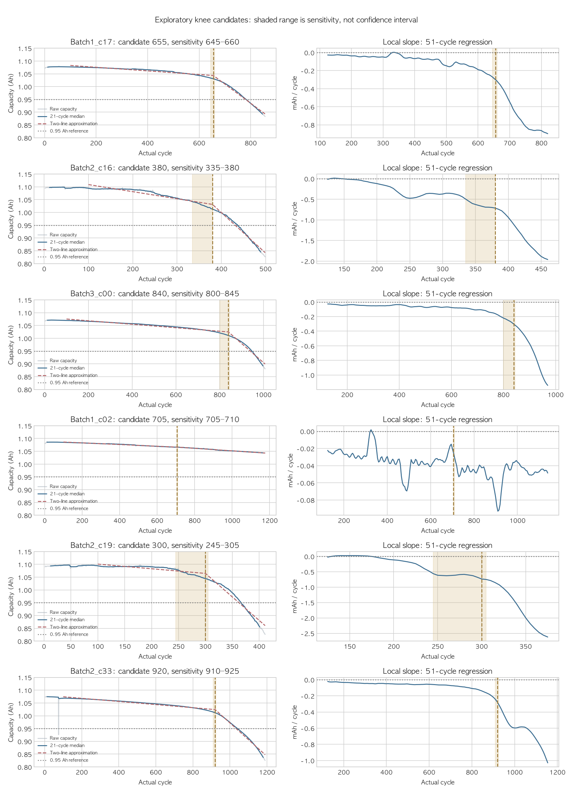
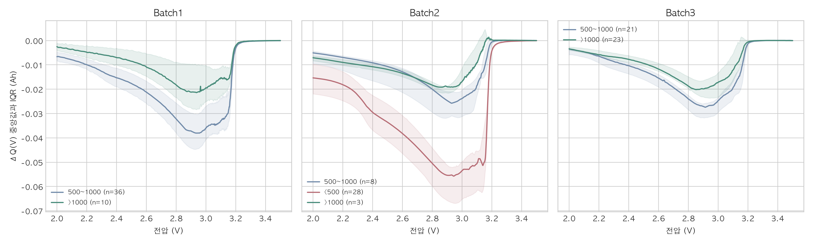
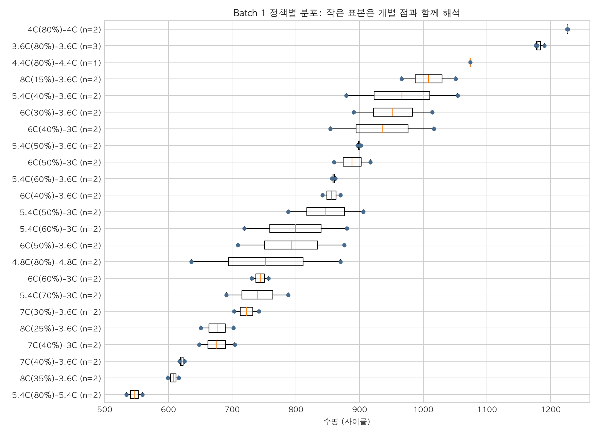

# [보고서] ESS 안전 운용을 위한 초기 충·방전 기반 배터리 수명(Cycle Life) 조기 예측 모델 설계서

- **문서 작성자**: 울산캠퍼스·4반·배영환 (Day 1 설계 및 Day 2 결과 보완)
- **작성 일자**: 2026-10-01
- **평가 배점 매핑**:
  - Q1~Q5 관측 결과와 검증 한계
  - EDA 관측과 모델링 전략의 근거·한계 연결
  - 피처 엔지니어링 및 모델 설계 논리

---

## 1. 프로젝트 목적과 현재 범위

배터리 전체 수명이 확인되기 전에 초기 충·방전 기록으로 수명을 추정할 수 있다면 셀 선별과 점검 계획에 도움이 될 수 있다. 본 프로젝트는 공개 고속 충전 실험 데이터에서 **초기 100사이클을 활용한 총수명 회귀**를 예측 과제로 선택했다. 모델의 내부 검증·Batch 2 평가를 수행했으며 ESS 현장 적용 가능성은 검증하지 않았다.

현재 완료한 분석은 **Q1: Batch 1·2·3 수명 분포**, **Q2: Batch 1·2·3 방전용량 열화 곡선**, **Q5: 세 배치 초기 요약 지표와 수명의 관계**다. 이를 바탕으로 과제 설계에서 **회귀 과제와 후보 피처 정의**, 검증 설계에서 **셀 단위 분할과 평가 절차**를 정했다. Q3·Q4 추가 관측과 Q2·Q5 세 배치 보완을 반영했다. Day 2 모델 비교·평가 결과는 7장에 정리했다. 100사이클이 전체 수명의 10% 미만이라는 일률적 표현은 사용하지 않는다.

---

## 2. 데이터 상태와 처리 범위

- Batch 1은 **46/46셀**, Batch 2는 **39/47셀**, Batch 3은 **44/46셀**이 수명 라벨을 보유한다. 라벨이 없는 셀은 수명 통계와 지도학습 평가에서 분리하고 원본은 보존한다. 결측 원인은 확인되지 않았다.
- Batch 1의 Cycle 1 요약값은 0이므로 초기 요약 지표는 Cycle 2부터 계산했다. Batch 2의 Cycle 1은 같은 패턴이 아니다. 이 차이를 포함한 배치 간 비교 가능성은 계속 점검해야 한다.
- `Batch2_c38`의 최고온도 400°C 기록과 Batch 1의 특이값 후보는 확인했지만, 센서 고장 원인이나 값 수정·클리핑 기준은 확정하지 않았다.
- 현재 전처리는 **수명 라벨 결측 셀의 평가 대상 분리**까지 확인됐다. 모든 변수의 처리 전후 분포와 측정 신뢰성 검증을 완료한 것으로 쓰지 않는다.

| 배치    | 전체 셀 | 수명 라벨 보유 | 현재 역할                   |
| ------- | ------: | -------------: | --------------------------- |
| Batch 1 |      46 |             46 | 학습·내부 검증 후보         |
| Batch 2 |      47 |             39 | 모델 확정 후 최종 평가 후보 |
| Batch 3 |      46 |             44 | 분포 비교; 추가 평가 선택   |

### 후속 확인

Batch 2의 짧은 수명과 `newstructure` 표기의 의미, 배치별 라벨 정의·셀 매핑, Cycle 1 기록 차이를 원자료와 대조한다. Batch 2 라벨 분포는 Q1에서 이미 확인했으므로 최종 평가는 라벨에 대한 완전 블라인드 평가가 아니다. 피처·모델 결정에는 Batch 1 내부 결과만 사용한다.

### 2.3 데이터 검증 프로세스 회고 및 교훈 (Engineering Retrospective)

- **초기 가정의 한계**: 초기에는 도메인 가이드의 '배치 간 데이터 분포가 유사하다'는 설명을 바탕으로 Batch 1~3이 동질적일 것으로 판단하고 작업을 착수했습니다. 이에 따라 데이터 무결성 및 구조 검증을 Batch 1을 주 기준으로 진행했습니다.
- **배치 간 차이 발견**: 이후 Q1 수명 분포 분석에서 Batch 1~3을 동시에 비교·검증한 결과, Batch 2의 500사이클 미만 비율(71.8%) 및 `newstructure` 이원화 등 배치 간 심각한 분포 괴리와 구조 차이를 뒤늦게 발견했습니다.
- **프로세스 개선 교훈**: 단일 배치에 의존하지 않고 초기 데이터 검증 단계에서부터 전체 배치(Batch 1~3)를 교차 비교·점검했다면 전처리 및 검증 설계 단계에서 사전에 인지하고 대응할 수 있었던 부분입니다. 향후 파이프라인 구축 시 '초기 다중 배치 동시 검증'을 표준 원칙으로 삼아야 함을 확인했습니다.

---

## 3. [본문] EDA 분석

Q1~Q5의 관측과 한계를 기록한다. 후보 상관은 독립 예측력이나 인과 효과의 증명이 아니며 모델 결과와 구분한다.

---

### [Q1] Cycle Life 수명 분포는 어떻게 생겼는가?

> **"배치별 수명 분포는 어떻게 다른가?"**

#### 1. 질문 본질 & 비즈니스 리스크

- 셀 수명 편차는 선별·점검 계획의 불확실성을 높일 수 있다.
- 셀 수명의 분포와 배치 간 차이를 정확히 파악해야 불량 셀 조기 스크리닝 기준 및 잔존가치 평가 모델을 올바르게 설계할 수 있습니다.

#### 2. 관측 결과 및 실측 증거

- **배치별 수명 요약 통계 (Batch 1, 2, 3 전수 비교)**:
  | 배치 | 라벨 보유 / 전체 | 평균 / 중앙값 (사이클) | 범위 | 500 미만 비율 | 1,000 초과 비율 | IQR 경계 밖 후보 |
  | --- | ---: | ---: | ---: | ---: | ---: | ---: |
  | **Batch 1** | 46 / 46 | 844.7 / 858.5 | 534–1,227 | 0 / 46 (0.0%) | 10 / 46 (21.7%) | 0개 (0%) |
  | **Batch 2** | 39 / 47 | 565.7 / 472.0 | 392–1,186 | 28 / 39 (71.8%) | 3 / 39 (7.7%) | 9개 (긴 수명 쪽) |
  | **Batch 3** | 44 / 46 | 1,059.7 / 1,005.5 | 541–1,935 | 0 / 44 (0.0%) | 23 / 44 (52.3%) | 3개 (긴 수명 쪽) |

- **Batch 2 내부 이원화 심층 관측 (신규 발견)**:
  - Batch 2는 500사이클 미만 셀이 71.8%에 달해 Batch 1·3과 짧은 수명 쪽에 집중된 분포를 보임.
  - 내부 정책명 대조 결과: **일반 정책 30셀(수명 392~514c, 중앙값 451c)**과 **`newstructure` 표기 9셀(수명 777~1,186c, 중앙값 904c)**의 수명 분포가 다름.
  - 동일한 기본 충전 프로토콜 3종에서도 일반 vs `newstructure` 간 수명 중앙값 차이 확인 (492c vs 809c, 483c vs 904c, 446c vs 997c).
  - 초기 Cycle 2 방전용량 중앙값은 일반 정책 **1.096 Ah**, `newstructure` **1.091 Ah**로 가깝다. 수명 라벨 시점 방전용량 중앙값은 약 **0.879 Ah**이며 라벨 이후에도 15~66사이클 측정이 이어진다. 단순 조기 기록 종료만으로 수명 차이를 설명하기 어렵다.

- [세 배치 수명 분포 그래프](../../results/q1_cycle_life_distribution.png)와 [IQR 후보 목록](../../results/q1_cycle_life_outlier_candidates.csv)을 확인했다. Batch 2 정책별 요약은 [EDA 노트북](../../notebooks/01_EDA.ipynb) 8장에 있다.

#### 3. 도메인/물리적 해석 & 한계

- **가이드 서술과의 괴리**: 프로젝트 가이드의 "Batch 1·2 수명 분포 유사" 서술과 달리 현재 파일의 Batch 2는 짧은 수명 쪽에 집중된다. 원인 확인을 위해 셀·시험 조건과 데이터 버전을 대조해야 한다.
- **Batch 2 배제 불가 원칙**: 비록 Batch 2의 수명이 짧더라도 짧은 수명 자체는 제외 근거가 아니므로, 라벨 보유 셀을 최종 평가 후보로 유지함.
- **한계**: 수명 분포와 Q2 곡선만으로는 Batch 2가 짧은 원인을 확정할 수 없다. Q3~Q5와 배치별 시험 조건을 추가 확인한다.

#### 4. 새로운 시사점 및 모델링 직결 전략

1. **타깃 누수(Data Leakage) 엄단 원칙**:
   - EDA 과정에서 Batch 2의 수명 분포를 이미 관측했으므로 엄밀한 의미의 완전 블라인드는 아님.
   - 따라서 **Batch 2의 라벨이나 분포 특성을 모델 튜닝이나 피처 선택에 사후 최적화(Snooping)하는 행위를 엄격히 금지**하며, 모든 모델 학습 및 피처 조합은 **Batch 1 내부 Hold-out 검증으로만 확정**함.
2. **회귀 과제 선택**:
   - 500사이클 미만은 Batch 1에서 0개다. 이는 Q1의 기술통계 구간이며, 가이드의 분류 라벨 기준은 **550사이클**이다. 550 미만은 Batch 1에서 1개로 불균형이 크다.
   - 초기 100사이클 입력과 연속형 수명 예측 목적에 맞춰 **회귀를 선택**했다. 후보 피처의 최종 조합은 Batch 1 내부 검증에서 결정한다.

**기준 정정 기록:** 초안에서는 **500사이클 미만**을 짧은 수명 구간으로 사용했고, 이를 분류 기준처럼 설명한 부분이 있었다. 500은 Q1 분포를 설명하기 위한 구간이며, [과제 가이드](../ESS%20Project_GUIDE.md)의 실제 이진 분류 기준은 **550사이클**이다. 기준을 550으로 바로잡으면 Batch 1의 단수명 클래스는 **1/46셀(2.2%)**이다. 분류가 수학적으로 불가능하다는 뜻은 아니지만, 이 데이터로 안정적인 학습·검증이 어렵다.

#### 5. 남은 과제 (Remaining Action Items)

- [ ] **`newstructure` 표기의 물리적/실험적 의미 규명**: Severson 원저자 코드 및 보충 자료를 대조하여 Batch 2 내 9개 셀의 실험 조건 특이성 검증.
- [ ] **데이터 버전 및 셀 매핑 일관성 확인**: 가이드 설명과 실제 `.mat` 파일 간의 분포 불일치 배경 추적.
- [ ] **하위 그룹별 일반화 오차(Subgroup MAPE) 분리 리포팅 설계**: Batch 2 최종 평가 시, 일반 정책 30셀과 `newstructure` 9셀에 대해 모델 오차를 각각 분리 집계하여 도메인 한계 보고서에 반영.

---

### [Q2] 방전용량은 초기와 후기 사이클에서 어떻게 변하는가?

#### 1. 질문

초기 100사이클의 용량 추세를 전체 수명에 적용해도 되는지, 측정 곡선 후반에 기울기 변화가 있는지 확인한다.

#### 2. 관측 결과

- Batch 1 46셀의 평균 방전용량은 Cycle 2 **1.0781 Ah**, Cycle 100 **1.0807 Ah**다. **42/46셀**에서 증가했고 평균 변화는 **+2.60 mAh**다. 초기 98사이클 평균 기울기는 **+0.027 mAh/cycle**다.
- 0.95 Ah에 도달한 셀은 **38/46개**다. 해당 셀의 첫 도달 시점은 평균 **722.7사이클**, 수명 라벨까지는 평균 **71.5사이클**(이 38셀의 평균 수명 대비 **9.0%**)이다. 나머지 **8셀은 기록된 구간에서 0.95 Ah에 도달하지 않았다.**
- [방전용량 열화 곡선](../../results/q2_discharge_capacity_degradation.png)은 일부 셀에서 후기 감소 기울기가 커짐을 보여준다. 0.95 Ah는 **임의로 정한 용량 기준**이지 변곡점(Knee-point) 탐지 결과가 아니다.

#### 3. 해석과 한계

초기 평균 기울기를 그대로 선형 외삽해 수명을 추정하는 방식은 부적절하다. 다만 모든 셀이 2단계 열화나 급격한 종말을 보인다고 단정할 수 없다. 8셀은 마지막 방전용량도 0.95 Ah보다 높아, 수명 라벨과 EOL 0.88 Ah 측정값의 대응을 확인해야 한다. 열화 기전은 이 곡선만으로 식별할 수 없다.

#### 4. 다음 분석과 모델 전략

초기 용량·변화량의 예측력은 수명과의 관계 및 Batch 1 검증으로 평가한다. 전압별 용량 변화와 저항은 후속 후보로 둔다. 이 단계에서 피처나 모델을 확정하지 않는다.

#### 5. 세 배치 비교 보완

기존 파일의 라벨 보유 129셀(Batch 1 46, Batch 2 39, Batch 3 44)을 동일 정의로 비교했다. 초기 변화는 Cycle 100−2, 중간 기울기는 Cycle 100~200, 기록 말기 기울기는 각 셀의 마지막 100사이클에 대한 선형 회귀 기울기다. 100사이클 이후 정보는 EDA에만 사용하며 예측 입력에 추가하지 않았다.

| 배치 | 초기 용량 변화 평균(mAh) | 증가 셀 | 0.95Ah 첫 도달 중앙값(사이클) | 중간 기울기 중앙값(mAh/cycle) | 기록 말기 기울기 중앙값(mAh/cycle) |
| --- | ---: | ---: | ---: | ---: | ---: |
| Batch 1 | +2.60 | 42/46 | 708 (38셀 도달) | −0.040 | −0.903 |
| Batch 2 | +2.11 | 25/39 | 432 (39셀 도달) | −0.006 | −1.891 |
| Batch 3 | +0.25 | 37/44 | 944 (44셀 도달) | −0.036 | −0.912 |

[세 배치 용량 곡선](../../results/q2/q2_three_batch_curves.png)과 [용량 기준 도달·기울기 비교](../../results/q2/q2_threshold_and_slopes.png)를 확인했다. 두 구간의 기울기는 129셀 모두 기록 말기에 더 음수였다. 이는 감소 속도가 일정하지 않다는 단서이며 정확한 knee 위치나 열화 기전의 증명은 아니다. 대표 셀의 knee 후보 탐색은 아래에 추가했다. 통계적 불확실성 검증은 수행하지 않았다. 배치별 기록 종료 조건이 같다는 보장도 없으므로 말기 기울기를 동일 EOL 단계의 비교로 단정하지 않는다.

Batch 2의 일반 표기 30셀과 newstructure 9셀은 첫 도달 중앙값이 각각 425, 797사이클로 달랐다. 표기의 물리적 의미나 원인 효과는 미확인이다. 특히 Batch2_c33은 Cycle 75의 일시적 하락 뒤 회복했다. 첫 통과를 열화 시작으로 오해하지 않도록 5개 연속 사이클에서 0.95Ah 이하인 경우도 비교했고, 배치별 중앙값은 708·437·944로 순서가 유지됐다. 5사이클 기준 역시 민감도 점검용이며 knee 정의는 아니다. 원본 값은 유지했고 그래프 표시 범위 밖 값도 계산에서 제외하지 않았다.

Q1의 Batch 2 짧은 수명 분포는 초기 용량 증가와 양립한다. 초기 추세를 전체 수명으로 외삽할 수 없다는 점을 확인했으며, 기존 모델의 Batch 2 과대예측을 이해할 단서로 활용한다. 이번 비교로 오차 원인을 확정하거나 기존 모델·라벨·평가 기록을 수정하지 않았다.

#### 6. Knee 후보 구간과 불분명한 점

**확인할 질문:** 용량 감소가 가팔라지는 부분은 어디로 보이며, 단일 시점을 확정하기 어려운 이유는 무엇인가?

대표 셀 6개를 비교했다. 배치별 수명 중앙값에 가장 가까운 셀 3개, Batch 1의 마지막 용량이 가장 높은 셀, Batch 2 최단수명 셀, 일시적 급락이 있던 Batch2_c33을 선정했다. 전체 129셀에 대한 knee 판정이나 배치별 knee 평균은 아니다.

원본 곡선에 21사이클 이동 중앙값을 겹치고 실제 51사이클 창의 국소 회귀 기울기를 확인했다. Cycle 100 이후 곡선에 연속된 두 직선을 근사해 전환 후보를 탐색했다. 후보 전후 각각 최소 약 100사이클을 확보하고 5사이클 간격으로 탐색했다. 중앙값 창 11·21·41과 마지막 50사이클 제외 조건에서 위치 변화를 비교했다. 아래 범위는 **설정 민감도 범위이며 신뢰구간도 실제 전환 구간의 경계도 아니다.** 두 직선 모형은 완만한 곡률이나 잡음에도 후보를 만들 수 있다.

| 셀 | 기본 근사 후보(사이클) | 설정별 후보 범위 | 후보로 보는 근거와 불분명한 점 |
| --- | ---: | ---: | --- |
| Batch1_c17 | 655 | 645~660 | 완만한 감소 뒤 국소 기울기가 더 음수로 변한다. 변화는 서서히 진행돼 655가 정확한 시작이라고 단정하지 않는다. |
| Batch2_c16 | 380 | 335~380 | 이후 감소가 가팔라지고 약 400 이후 추가 가속이 보인다. 앞선 약 200~250에도 변화가 있어 한 번의 전환으로 요약하기 어렵다. |
| Batch3_c00 | 840 | 800~845 | 후기 용량 곡선의 굽어짐과 기울기 감소가 함께 보인다. 말기 50사이클 제외 시 위치가 앞당겨져 종료 구간의 영향을 받는다. |
| Batch1_c02 | 705 | 705~710 | 숫자는 안정적이지만 근사 기울기가 −0.033에서 −0.050mAh/cycle로 조금 변할 뿐이다. 기록 내 뚜렷한 급격한 knee 근거는 약하다. |
| Batch2_c19 | 300 | 245~305 | 곡선과 국소 기울기에 여러 변화가 보인다. 기본 후보가 탐색 상한에 걸려 최소 구간 길이 조건의 영향이 크므로 위치 신뢰는 낮다. |
| Batch2_c33 | 920 | 910~925 | 약 900대 이후 지속적인 감소 가속이 보인다. Cycle 75의 일시적 급락·회복은 이 후기 변화와 구분한다. |

**관측 결과:** 일부 대표 셀의 후기 굽어짐은 knee 후보로 설명할 수 있다. 반면 기울기가 조금 달라질 뿐인 셀이나 여러 차례 변화하는 셀에서는 단일 knee 위치가 불분명하다. 따라서 ‘탐지하지 않았다’에서 끝내지 않고 후보 위치와 그 근거·한계를 함께 제시한다. 0.95Ah는 용량 수준이고 knee 후보는 곡선 변화에 관한 것이므로 같은 개념으로 명명하지 않는다.

**활용과 한계:** 초기 증가가 전체 수명의 선형 감소를 뜻하지 않는다는 Q2 해석을 보강한다. 여기서는 후기 기록을 사용하는 사후 탐색이며 초기 100사이클 예측 피처에 넣지 않는다. 통계적 신뢰구간·독립 데이터 검증·열화 기전 식별은 수행하지 않았다. 합성 곡선의 알려진 전환점 회수 검사는 계산 구현을 확인하는 용도이며 실제 셀의 knee를 검증한 것은 아니다. 물리적 열화 원인은 용량 곡선만으로 확정하지 않는다.

정의와 방법에 관한 참고: Attia et al. (2022), [Review—“Knees” in Lithium-Ion Battery Aging Trajectories](https://arxiv.org/abs/2201.02891). 본 후보 계산은 프로젝트의 탐색적 근사이며 해당 논문의 특정 검출법을 재현한 결과가 아니다.

**Q1·Q2 연결 점검:** Batch 1 46셀에서 $Q_{100}-Q_2$와 수명의 상관은 Pearson **0.540**, Spearman **0.566**이다. 두 최단수명 셀을 제외해도 Pearson은 약 **0.484**다. 그러나 동일 충전 정책 안에서 정책 평균 대비 차이로 비교하면 45셀의 Pearson은 **0.024**다. 정책별 표본이 대부분 2셀이라 독립적인 관계의 부재를 확정할 수는 없지만, 전체 상관에 정책 차이가 섞였을 가능성이 있다. [비교 산점도](../../results/q1_q2_capacity_change_vs_life.png)를 참고한다. 이 변화량은 피처 후보로 남기고, 채택은 Batch 1 내부 검증에서 결정한다.

---

### [Q3] 전압별 용량 변화와 수명

**초기 100사이클 안에서도 전압별 용량 곡선의 차이는 관측된다.** 공통 전압 축은 모든 셀에서 1,000포인트, 2.0~3.5V다. 139셀 모두 원본 대응 검사를 통과했고 라벨 보유 129셀의 로그 분산을 계산했다. 그림은 장수명·단수명 구간의 곡선 모양이 다르지만 일부 겹침과 국소적인 요철도 있음을 보여준다. 원본을 임의로 평활화하거나 요철을 오류로 제거하지 않았다.

- 로그 분산과 수명의 Pearson r는 Batch 1 **−0.886**, Batch 2 **−0.902**, Batch 3 **−0.702**다. Batch 1 Train 36셀에서도 **−0.872**다. 곡선 변화의 분산이 큰 셀일수록 수명이 짧은 관계가 관측된다.
- 그러나 동일 정책 평균을 뺀 Batch 1 45셀의 상관은 **−0.072**다. 정책당 대부분 2셀이라 강한 결론은 어렵지만, 전체 관계가 정책 차이를 반영할 가능성이 있다. 정책이 달라진 새 셀에 독립적으로 유용한지는 검증해야 한다.
- Batch 1의 ΔQ 평균·최솟값끼리 r=**0.993**, 로그 분산과 최솟값은 r=**−0.947**이다. 여러 통계값을 모두 넣으면 비슷한 정보를 중복할 수 있다.

**설계 제안:** 로그 분산 하나를 우선 추가 후보로 검토한다. 기존 요약 용량 변화만 보는 것보다 전압별 곡선 변화의 정보를 담을 수 있지만, 실제 개선 여부는 Batch 1 Train 내부 CV에서 비교한다. 이 EDA만으로 최종 피처 채택이나 목표 MAPE 달성을 주장하지 않는다. Batch 1에는 <500 셀이 없으므로 장·단수명 직접 비교를 수행했다고 표현하지 않는다.

### [Q4] 충전 정책과 수명

**Batch 1에서는 첫 C-rate가 높을수록 수명이 짧아지는 전체 관계가 있지만, 모든 배치와 정책에 일률적으로 적용되지는 않는다.** 첫 C-rate와 수명의 Pearson r는 Batch 1 **−0.580**, Batch 2 **+0.191**, Batch 3 **−0.083**이다. 서로 다른 정책 구성과 `newstructure` 조건을 섞어 단순한 원인으로 해석할 수 없다.

- Batch 1에서 첫 단계가 모두 5.4C인 정책도 평균 수명이 **546.5~966.5사이클**로 다르다. 전환 SOC와 두 번째 C-rate까지 충전 조건으로 고려해야 한다.
- 첫 C-rate별 평균도 5.4C **808.3**, 6C **861.5**, 7C **673.2**, 8C **764.2사이클**로 단조 감소하지 않는다. 셀 수와 다른 조건이 달라 직접적인 속도 비교 실험으로 볼 수 없다.
- Batch 1의 첫 C-rate는 초기 최고온도와 r=**0.450**, 초기 용량 변화와 r=**−0.220**이다. 온도 관련 경로를 추가 확인할 단서지만 고속충전이 열화를 유발했다는 인과 증거는 아니다. 초기 용량 변화는 전체 수명의 열화 속도가 아니다.
- Batch 1 23개 정책 중 **21개는 2셀, 1개는 3셀, 1개는 1셀**이다. 박스플롯의 개별 점과 표본 수를 함께 봐야 한다. 대표 3셀의 Cycle 10·100 실제 전류 패턴은 유사하게 이어지지만 전체 셀의 패턴 안정성을 검증한 것은 아니다.

**설계 제안:** `charge_c1_rate` 단독 설명은 보강이 필요하다. 첫 C-rate·두 번째 C-rate·전환 SOC를 각각 검토하되 작은 표본에서 변수를 늘릴 가치는 Batch 1 내부 검증으로 결정한다. `newstructure`를 물리적 구조 변화라고 해석하지 않으며 의미 확인 전 인과 설명에 사용하지 않는다. 정책과 열화 관계를 더 깊게 확인하는 일은 후속 과제로 남길 수 있다.

### Q2·Q3·Q4를 함께 해석하는 방법

- Q2의 `QDischarge`는 한 사이클의 총 방전용량이고 Q3의 `Qdlin(V)`는 공통 전압 축에서 보간한 용량 곡선이다. 비교 구간도 Q2는 Cycle 2~100, Q3는 Cycle 10~100으로 다르다. 총 방전용량이 증가하면서 전압별 ΔQ(V)는 음수일 수 있으므로 서로 모순이라고 볼 수 없다. 초기 총 용량 변화만으로 드러나지 않는 곡선 변화도 함께 확인한 것이다.
- Q2 용량 변화의 전체 상관 0.540·동일 정책 내 0.024와 Q3 로그 분산의 전체 −0.886·동일 정책 내 −0.072는 모두 정책 영향 가능성을 보여준다. 동일 정책당 대부분 2셀이라는 한계가 있어 독립 예측력은 학습 검증으로 판단한다.
- Q4는 Batch 2의 짧은 수명을 첫 C-rate 하나로 설명하기 어렵다는 근거를 보강한다. 회귀 과제와 Batch 1 내부 모델 선택·Batch 2 최종 평가라는 방향은 유지한다.

### [Q5] 초기 신호와 수명 관계: 세 배치 비교와 한계

#### 확인한 결과: Batch 1 46셀

[EDA 노트북 3장](../../notebooks/01_EDA.ipynb)의 초기 지표 산점도와 [Q1·Q2 연결 비교 그래프](../../results/q1_q2_capacity_change_vs_life.png)를 바탕으로 셀 단위 Pearson 상관을 확인했다.

| 초기 지표 | 수명과 Pearson r | 해석 범위 |
| --- | ---: | --- |
| Cycle 2 방전용량 $Q_2$ | 0.086 | 선형 상관이 약함 |
| Cycle 2 내부저항 $IR_2$ | 0.084 | 선형 상관이 약함 |
| Cycle 100 방전용량 $Q_{100}$ | 0.295 | 약한 양의 상관 |
| 방전용량 변화 $Q_{100}-Q_2$ | 0.540 | 전체 셀에서 양의 상관 |
| 저항 변화 $IR_{100}-IR_2$ | 0.142 | 강한 선형 상관 근거 없음 |
| Cycle 2~100 최고온도 | −0.400 | 음의 상관 관측; 원인·독립 효과 미확인 |

$Q_{100}-Q_2$의 Spearman 상관은 **0.566**이며, 최단수명 2셀을 제외한 Pearson은 **0.484**다. 반면 같은 충전 정책 내 평균 대비 차이로 비교한 45셀의 Pearson은 **0.024**다. 정책별 셀이 대부분 2개이므로 독립 효과의 유무를 확정할 수 없고, 전체 상관에 정책 차이가 섞였을 가능성이 있다.

#### 확인한 특이사항과 한계

Batch 1의 Cycle 2~100 최저온도는 0으로 고정되지 않았고, 이 구간의 `delta_t`도 `Tmax`와 같지 않다. 초기의 `Tmin=0`, `Tmax=delta_t` 관측을 전체 분석 구간의 성질로 확대하지 않는다. 평균 충전시간은 일부 셀의 Cycle 13 약 419분 기록에 영향을 받으므로 원인 확인 전 피처로 확정하지 않는다. 위 상관은 예측 성능이나 열화 원인을 입증하지 않는다.

### Q5 비교 결과와 활용 범위

| 초기 신호와 수명의 Pearson r | Batch 1 | Batch 2 | Batch 3 |
| --- | ---: | ---: | ---: |
| 방전용량 변화 Q100−Q2 | 0.540 | −0.199 | 0.277 |
| 초기 99사이클 최고온도 | −0.400 | −0.016 | −0.090 |
| 내부저항 변화 IR100−IR2 | 0.142 | 0.353 | −0.385 |
| 충전시간 중앙값 | 0.744 | −0.918 | 0.638 |

18개 요약 후보 중 세 배치 모두 절대 Pearson 상관이 가장 큰 것은 충전시간 중앙값이었다. 전체 후보에 대한 최우수 예측 변수라는 뜻은 아니다. 기존 Q3 로그 분산·정책 변수는 별도의 분석 결과와 함께 검토한다. 충전시간 중앙값의 Spearman은 각각 0.641/−0.812/0.261로, 특히 Batch 3에서 선형 상관과 순위 상관의 강도가 다르다. 개별 관측이나 집단 구성이 결과에 영향을 줄 수 있다.

Batch 2를 표기별로 나누면 충전시간 중앙값의 Pearson은 일반 30셀 −0.255, newstructure 9셀 0.084로 약해진다. 따라서 전체 −0.918은 집단 구성의 영향 가능성이 있으며 충전시간이 수명을 결정한다는 인과 해석은 하지 않는다. 표기의 물리적 의미도 미확인이다. 5사이클·온도·전류 등 실제 시험 조건이 동일한 통제 비교는 아니다.

충전/방전용량, 온도, 충전시간의 여러 후보에서 |r|≥0.9 중복을 확인했다. 예를 들어 Batch 1 Tmax와 온도 범위는 0.969, 초기 충전시간과 중앙값은 0.998이다. 후보를 모두 넣으면 중복이 커질 수 있다. 쌍별 상관은 VIF와 같지 않으며 기존 Train 6피처의 VIF·변수 축소 결과를 함께 사용한다. 평균 충전시간은 장시간 기록 영향도 있어 중앙값과 구분한다.

Q1의 배치 분포 차이, Q2의 후기 변화와 연결해 보면 입력과 수명 사이 관계 자체도 배치마다 다를 수 있다. 이는 Batch 1 모델의 Batch 2 오차를 이해할 추가 단서다. Test 결과를 본 뒤 수행한 탐색이므로 이 결과로 모델을 재선택하거나 같은 Test 성능을 다시 최종 성능으로 사용하지 않는다. 기존 6피처와 모델·평가 기록을 유지한다.

---

## 4. 예측 과제와 후보 피처 정의

초기 100사이클(Cycle 2~100)의 요약 측정값과 예측 시점에 알려진 충전 정책을 검토한다. [후보 정의표](../../results/candidate_features_definition.csv)는 **입력 후보 9개와 사후 정보 제외 1개**의 계산식·단위·검토 상태를 기록한다. 이 표는 최종 피처 조합이나 전처리 결과가 아니다.

원본 재검증에서 $IR_{100}-IR_2$와 수명의 상관은 **0.142**이며 값도 대부분 증가가 아니다. 최고온도와 최고−최저온도는 **r=0.969**로 중복 가능성이 크다. Batch 1의 최고온도 최댓값은 **38.73°C**다. 따라서 저항 증가를 열화 증거로, 두 온도 지표를 독립 피처로, 60°C 초과 기록을 센서 오류로 단정하지 않는다.

| 변수 | 확인된 근거 | 검토 상태·추가 검증 |
| --- | --- | --- |
| $Q_{100}-Q_2$ | 수명과 전체 r=0.540, 동일 정책 내 r=0.024 | 후보; 정책 영향과 검증 성능 확인 |
| $IR_{100}-IR_2$ | 수명과 r=0.142, 대부분 증가값 아님 | 보류; 측정 정의·분포 확인 |
| Cycle 2~100 최고온도 | 수명과 r=−0.400 | 후보; 정책 영향·원본 이상값 확인 |
| 최고−최저온도 | 최고온도와 r=0.969 | 보류; 중복 피처 여부 확인 |
| 평균 충전시간 | Cycle 13 약 419분 기록 3셀의 영향 | 보류; 원인 확인 전 원본 유지 |
| 정책 첫 C-rate | Q1에서 정책별 수명 차이 관측 | 후보; 문자열 파싱·정책별 표본 수 확인 |
| 전압별 $\Delta Q(V)$ 로그 분산 | Batch 1 전체 r=−0.886, 동일 정책 내 −0.072 | 후보; 내부 CV에서 추가 가치 검증 |
| 정책 두 번째 C-rate·전환 SOC | 첫 C-rate가 같아도 정책별 수명 차이 | 후보; 소표본에서 추가 가치 검증 |
| `n_cycles` | 실험 종료 후 기록량 | 입력 제외 |

**처리 원칙:** 60°C 클리핑이나 Cycle 13 값 대체를 확정하지 않았다. 대체·스케일링·인코딩이 필요하면 Batch 1 학습 분할에서만 `fit`한다. 수명 타깃과 예측 시점 이후 자료는 모델 입력에서 제외한다.

---

## 5. 예측 과제 선택과 검증 설계

### 5.1 과제 선택

초기 100사이클로 `cycle_life`를 예측하는 **회귀**를 선택했다. 가이드의 분류 과제는 초기 5사이클과 **550사이클 기준**을 사용한다. Batch 1의 550 미만 셀은 **1/46개**라 현재 데이터로 안정적인 분류 학습·검증이 어렵다. 연속 수명값은 셀 선별·점검 계획에 더 구체적인 정보를 줄 수 있다. $\log(\mathrm{cycle\_life})$는 비교할 타깃 변환 후보이며 채택하지 않았다.

### 5.2 분할 결과와 평가 설계

- **셀 단위 Hold-out:** Batch 1의 라벨 보유 46셀을 `random_state=42`로 **Train 36셀 / Validation 10셀**로 나눴다. [분할 명세](../../results/train_val_split_cells.csv)에 모든 셀 ID와 역할을 저장했고, 셀 ID 중복은 **0개**다.
  - Train 수명: 534~1,190사이클, 평균 830.7, 중앙값 849.5.
  - Validation 수명: 616~1,227사이클, 평균 895.3, 중앙값 874.5.
  - 양쪽에 있는 충전 정책은 **8종**이다. `4C(80%)-4C` 정책의 **2셀(1,226·1,227사이클)**은 Validation에만 있다. 셀 분리는 확인됐지만 미관측 정책 일반화까지 검증한 것은 아니다.
- **분할 결과 해석:** [EDA 노트북 10장](../../notebooks/01_EDA.ipynb)과 저장한 CSV를 대조했다. 550사이클 미만 셀 1개는 Train에, Validation에는 0개가 들어갔다. 이 분할의 셀 ID는 재현되지만 단일 분할의 성능만으로 전체 정책·수명 구간에 대한 안정성을 주장할 수 없다.
- **누수 방지 설계:** 타깃 `cycle_life`와 사후 정보 `n_cycles`는 입력에서 제외한다. 대체·스케일링·정책 인코딩은 Train에서만 `fit`하고 Validation/Test에는 `transform`한다. 이 절차는 **설계**이며 아직 모델 전처리·학습의 실행 검증 결과가 아니다.
- **후보 모델:** Train 수명 중앙값을 예측하는 DummyRegressor를 기준으로 두고, 규제 선형 모델과 깊이를 제한한 트리 모델을 Batch 1 Validation에서 비교한다. 구체적 후보·하이퍼파라미터는 평가 전에 기록한다.
- **평가 지표:** MAPE(%)를 사용한다. Valid−Train, Test−Valid, Test−목표(9.1%) 차이는 **%p**로 보고한다. Train에 다시 예측한 점수는 CV 평균이 아니며, 한 Validation 분할을 반복 튜닝에 쓰면 그 점수도 낙관적으로 편향될 수 있다.
- **가이드와의 차이:** 현재 방식은 단일 셀 단위 Hold-out이다. 과제 가이드가 요구한 Train 내부 CV 평균은 **미실시**로 표시하고, 제출 표의 Train 지표 정의를 확인한다.
- **최종 테스트:** Batch 2 라벨 보유 39셀은 모델·피처·튜닝 확정 후 한 번 평가한다. Q1에서 Batch 2 라벨 분포를 이미 확인했으므로 완전 블라인드 라벨 평가라고 부르지 않는다.

### 5.3 EDA 결과와 설계 결정의 연결

| 확인한 사실 | 과제·검증 설계에 반영한 결정 | 아직 검증하지 않은 것 |
| --- | --- | --- |
| Batch 1 수명은 534~1,227사이클, 550 미만은 1셀 | 초기 100사이클 기반 연속 수명 회귀 선택 | 회귀 모델의 예측 오차 |
| $Q_{100}-Q_2$와 수명의 전체 상관 0.540, 동일 정책 내 0.024 | 용량 변화는 후보로 두고 정책 영향 검토 | 독립적인 피처 가치와 최종 조합 |
| Batch 2 분포가 Batch 1과 다르고 라벨 분포를 Q1에서 확인 | 피처·모델 결정은 Batch 1 내부에서 수행, Batch 2는 확정 후 평가 | 새로운 배치·정책에 대한 일반화 성능 |
| Train/Validation 셀 중복 0개, 정책 8종은 양쪽에 존재 | 현재 분할은 셀 단위 Hold-out으로 보고 | 정책 기준 그룹 분리 및 분할 민감도 |

---

## 6. 결론 및 Day 2 실행 로드맵

이 장은 Day 1의 설계 기록과 당시 계획이다. 현재 모델 결과는 7장과 Day 2 결과 보고서를 기준으로 한다. 모델 선택은 Train 내부 CV에서 수행했다.

- **Day 1 성과**:
  - 배치별 수명 분포 차이(Q1)와 세 배치의 초기·후기 방전용량 변화(Q2)를 확인했습니다.
  - 초기 용량 변화($Q_{100}-Q_2$)와 수명의 전체 상관(r=0.540), 동일 정책 내 약한 상관(r=0.024)을 함께 기록했습니다.
  - **초기 100사이클 기반 연속형 수명 회귀 과제**와 **36:10 셀 단위 Hold-out 검증 아키텍처**를 확정하고 분할 명세를 저장했습니다.
- **Day 2 실행 로드맵**:
  1. `src/features.py` 및 `src/models.py` 모듈화 파이프라인 구현.
  2. Batch 1 Train(36셀) 학습 및 Val(10셀) 검증을 통한 최적 모델/피처 조합 확정.
  3. Batch 2 (39셀) 대상 단 1회 최종 평가 및 일반화 Gap 분석 보고서 작성.
  4. GitHub 최종 커밋 및 `README.md` 최종 납품.
- **보고 원칙**: 9.1% MAPE는 벤치마크 기준치이며, 우리 모델의 성능은 Day 2 실측 검증 후 투명하게 보고합니다. 불확실한 비용 절감이나 화재 예방 수치를 단정하지 않고 예측 오차와 적용 한계를 엄밀하게 검증할 계획입니다.

---

## 7. 모델 실험 결과와 현재 결론

초기 100사이클 기반 회귀에서 Train 36셀의 동일 3-fold로 22개 후보를 비교했다. StandardScaler+Ridge(alpha=0.1), 용량 변화·최고온도·ΔQ(V) 로그 분산·첫 C-rate·두 번째 C-rate·전환 SOC의 6피처를 선택했다. 전처리는 각 fold의 학습 부분에만 적합했다.

| 평가 항목 | 값 | 단위 |
| --- | ---: | --- |
| Train 3-fold CV (36셀) | 9.88 | % |
| Validation (10셀) | 8.93 | % |
| Batch 2 Test (39셀) | 58.73 | % |
| Gap: Valid−Train CV | -0.95 | %p |
| Gap: Test−Valid | 49.80 | %p |
| Gap: Test−목표 9.1% | 49.63 | %p |

MAPE는 낮을수록 좋으며 Gap은 뒤 단계−앞 단계로 계산한다. 양수 Gap은 오차 증가를 뜻한다. Batch 2의 39셀 중 36셀을 과대예측했고 평균 부호 오차는 +253.05사이클이었다. 일반 표기 30셀의 MAPE는 72.34%, newstructure 9셀은 13.38%다. 목표 9.1% 미달을 그대로 보고한다. 배치의 수명 분포와 입력 관계가 달라지는 관측은 단서이며 단독 원인은 확정하지 않았다.

Train 후속 변수 축소 비교의 최저 MAPE는 C1 제외 11.47%, SOC 제외 11.59%로 기존 9.88%보다 높았다. 현재 6피처를 유지하되 독립 계수의 인과 해석은 보류한다. Test 확인 이후의 Q2·Q5 비교는 탐색으로 구분하며 모델 재선택·Test 재평가를 하지 않았다. ESS 현장 적용 성능은 검증하지 않았다.

자세한 실험·오류 분석과 한계는 [Day 2 결과 보고서](DAY2_MODEL_RESULT.md)에 기록했다. 공식 후속 자료 확보·연결 후보 검토는 해당 보고서 말미의 추가 참고사항으로만 남겼고 현재 모델에는 사용하지 않았다. GitHub 공개 상태·최종 제출·PDF 출력 검증은 아직 확인하지 않았다.
